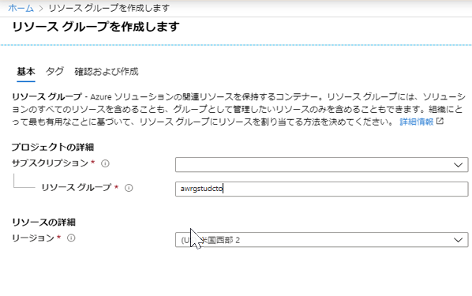
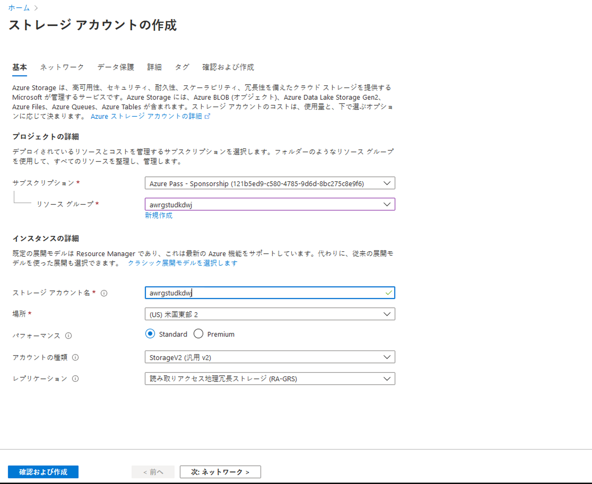
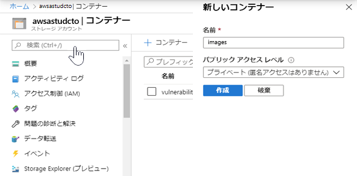
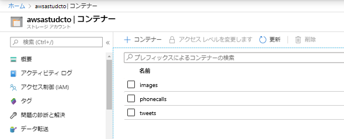
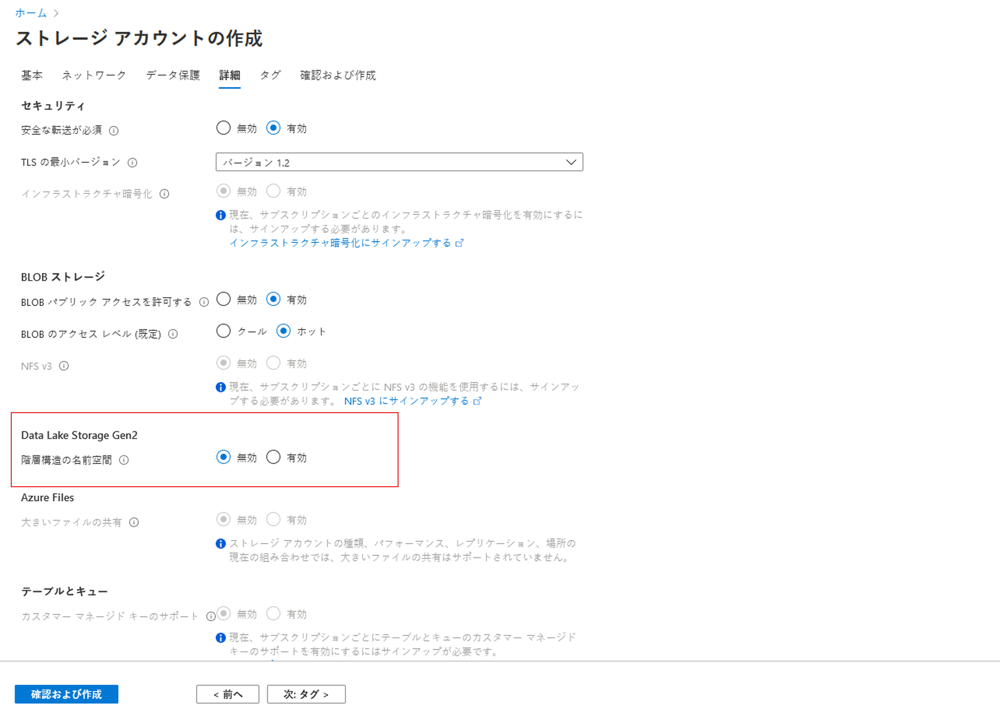
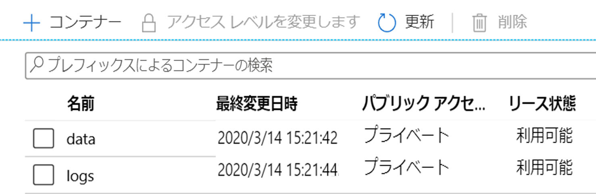

# DP 200 - データ プラットフォーム ソリューションの実装
# ラボ 2 - データ ストレージの使用

**推定時間**: 60 分

**前提条件**: このラボのケース スタディは既に確認していることを前提としています。モジュール 1:  「データ エンジニアのための Azure」の内容とラボを完了していることも前提としています。

**ラボ ファイル**: このラボのファイルは、_Allfiles\Labfiles\Starter\DP-200.2_ フォルダーにあります。

## ラボの概要

受講者は、ビジネス要件と技術要件に応じて、実装すべき適切なストレージのタイプを決定します。Azure Storage アカウントと Data Lake Storage アカウントを作成し、Data Lake Storage バージョン 1 とバージョン 2 の違いを習得します。また、選択したデータ ストレージへのデータの読み込みを実行する方法を習得します。

## ラボの目的
  
このラボを完了すると、次のことができるようになります。

1. Azure でのデータ ストレージ手法を選択する
2. Azure Storage アカウントを作成する
3. Azure Data Lake Storage について説明する
4. Azure Data Lake にデータをアップロードする

## シナリオ
  
あなたは、デジタル変革プロジェクトの一部であるテクノロジー ソリューションを実装するために、シニア データ エンジニアとして採用されました。組織では、会社の Web サイトをホストするインターネット インフォメーション サービス (IIS) を Azure に移行しようとしています。開発者たちは、Web アプリケーションとそのロジックを Azure Web Apps に転送中であり、Web サイトで使用する静的イメージのホスティングに使用できるデータ ストアの準備をあなたに依頼しました。

情報サービス部門からは、チームを拡大中であり、データ サイエンティストも間もなくチームに加わることを知らされました。データ サイエンティストは、予測分析ソリューションの構築プロセスをまもなく開始します。データ サイエンティストの作業の運用環境をホストするために使用するソリューションを設定することも求められました。まず第一に、ソリューションに対して作成する適切なストレージ層を評価します。

このラボでは、次のことを行います。

1. Azure でのデータ ストレージ手法を選択する
2. Azure ストレージ アカウントを作成する
3. Azure Data Lake Storage について理解する
4. Azure Data Lake にデータをアップロードする

> **重要**: このラボを進める中で発生したプロビジョニングまたは構成タスクの問題については、メモに書き留め、_\Labfiles\DP-200-Issues-Docx_にあるドキュメントの表に記録してください。ラボ番号、テクノロジ、発生した問題、解決した方法を記述しておきます。このドキュメントは、後のモジュールで参照できるように保存します。

## 演習 1: Azure のデータ ストレージ手法を選択する

推定時間: 15 分

個別演習
  
この演習の主なタスクは、以下の通りです。

1. ケース スタディから、Web サイトの静的イメージおよび予測分析ソリューションのデータ ストレージ要件を明らかにします。

2. インストラクターは、わかったことについてグループと話し合います。

### タスク 1: AdventureWorks のデータ ストレージの要件と構造を特定する

1. ラボの仮想マシンから **Microsoft Word** を起動し、**Allfiles\Labfiles\Starter\DP-200.2** フォルダーからファイル **DP-200-Lab02-Ex01.docx** を開きます。

2. このラボのシナリオの説明に従って、**10 分間**でデータ ストレージ要件を文書化します。追加の参照資料として、ケース スタディ ドキュメントを使用することもできます。

### タスク 2: わかったことについてインストラクターと話し合う

1. インストラクターは、わかったことについて話し合うためにグループを中断させます。

> **結果**: この演習を完了すると、データ ストレージ要件の 2 つの表を示す Microsoft Word ドキュメントが作成されます。

## 演習 2: Azure Storage アカウントを作成する
  
推定時間: 20 分

個別演習
  
この演習の主なタスクは次のとおりです。

1. ラボの場所に最も近いリージョンに **awrgstudxx** という名前の Azure リソース グループを作成します (**xx** には自分のイニシャルを入れます)。

2. リソース グループ awrgstudxx 内で、ラボの場所に最も近いリージョンに **awrgstudxx** という名前のストレージ アカウントを作成して構成します (**xx** には自分のイニシャルを入れます)。

3. awsastudxx ストレージ アカウント内に、**images**、**phonecalls** および **tweets** という名前のコンテナーを作成します。

4. ストレージ アカウントのイメージ コンテナーにグラフィックをアップロードします。

### タスク 1: リソース グループを作成して構成する

1. ラボの仮想マシンから Microsoft Edge を起動し、[**http://portal.azure.com**](http://portal.azure.com) で Azure portal を開き、コース用に割り当てられているアカウントを使用してログインします。

2. Azure portal で、「**リソース グループ**」 アイコンをクリックします。

3. 「**リソース グループ**」 画面で、「**+ 追加**」 をクリックし、次の設定を使用して最初のリソース グループを作成します。

    - **サブスクリプション**: このラボで使用するサブスクリプションの名前
    
    - **リソース グループ名**: **awrgstudxx** (**xx** は自分のイニシャル)。

    - **リソース グループの場所**: ラボの場所に最も近い Azure リージョンと、Azure VM をプロビジョニングできる場所の名前

      > **注**: サブスクリプションで使用可能な Azure リージョンを特定するには、[**https://azure.microsoft.com/ja-jp/regions/offers/**](https://azure.microsoft.com/ja-jp/regions/offers/) をご覧ください。

        

4. 「リソース グループの作成」 画面で、「**レビューと作成**」 をクリックします。

5. 「リソース グループの作成」 画面で、「**作成**」 をクリックします。

> **注**: リソース グループの作成には約 30 秒かかります。通知領域を確認して、作成が完了した時点を確認できます。

### タスク 2: ストレージ アカウントを作成して構成する

1. Azure portal 画面の左上にある 「**ホーム**」 ハイパーリンクをクリックします。

2. Azure portal で、「**+ リソースの作成**」 アイコンをクリックします。

3. 「新規作成」 画面で、「**マーケットプレースの検索**」 テキスト ボックスをクリックし、「**ストレージ アカウント**」と入力します。表示される一覧の 「**ストレージ アカウント**」 をクリックします。

4. 「**ストレージ アカウント**」 画面で、「**作成**」 をクリックします。

5. 「**ストレージ アカウントの作成**」 画面から、次の設定を使用して最初のストレージ アカウントを作成します。

    - プロジェクトの詳細で、次の設定を指定します。

        - **サブスクリプション**: このラボで使用するサブスクリプションの名前
    
        - **リソース グループ**: **awrgstudxx** (**xx** は自分のイニシャル)。

    - インスタンスの詳細で、次の設定を指定します。
    
        - **ストレージ アカウント名**: **awsastudxx** (**xx** は自分のイニシャル)

        - **場所**: ラボの場所に最も近い Azure リージョンの名前と、Azure VM をプロビジョニングできる場所。

        - **パフォーマンス**: **Standard**:

        - **Redundancy**: **geo 冗長ストレージ (RA_GRS)**

            

6. 「**ストレージ アカウントの作成**」 画面で、「**確認と作成**」 をクリックします。

7. 「**ストレージ アカウントの作成***」 画面の検証後、「**作成**」 をクリックします。

   > **注**: ストレージ アカウントを作成する際、定義した設定に基づくディスクとそのディスクの構成準備に約 90 秒かかります。

### タスク 3: ストレージ アカウント内でコンテナーを作成して構成する

1. Azure portal で、「_デプロイが完了しました_」 というメッセージが表示されたら、「**リソースに移動**」 ボタンをクリックします。

2. 「**awsastudxx**」 (**xx** は自分のイニシャル) 画面で、「**BLOB サービス**」 の下の 「**コンテナー**」 をクリックします。

3. 「**awsastudxx - コンテナー**」 画面の左上で、「**+ コンテナー**」 クリックします。

4. 「**新しいコンテナー***」 画面から、次の設定を持つコンテナーを作成します。

    - 名前: **images**。

    - パブリック アクセス レベル: **非公開 (匿名アクセスなし)**

        

5. 「**新規コンテナー**」 画面で、「**作成**」 をクリックします。

   > **注**: コンテナーはすぐに作成され、「**awrgstudxx - Containers**」 画面のリストに表示されます。

6. ステップ 4 から 5 を繰り返して、「**プライベート (匿名アクセスなし)**」 のパブリック アクセス レベルで「**phonecalls**」という名前のコンテナーを作成します。

7. ステップ 4 から 5 を繰り返して、「**プライベート (匿名アクセスなし)**」 のパブリック アクセス レベルで「**tweets**」という名前のコンテナーを作成します。画面は次の図のようになります。

    

### タスク 4: ストレージ アカウントのイメージ コンテナーにグラフィックをアップロードする

1. Azure portal の 「**awsastudxx - Containers**」 画面で、リストから 「**images**」 をクリックします。

2. 「**images**」 画面で、「**アップロード**」 ボタンをクリックします。

3. 「**BLOB のアップロード**」 画面内の 「ファイル」 テキスト ボックスで、テキスト ボックスの右側にある 「**フォルダー**」 アイコンをクリックします。

4. 「**開く**」 ダイアログ ボックスで、**Labfiles\Starter\DP-200.2\website graphics** フォルダーを開きます。次のファイルを選択します。

    - one.png

    - two.png

    - three.png

    - No.png

5. 「**開く**」 ダイアログ ボックスで、「**開く**」 をクリックします。 

6. 「**BLOB のアップロード**」 画面で、「**アップロード**」 ボタンをクリックします。

7. 「**BLOB のアップロード**」 画面を閉じ、「**images**」 画面を閉じます。

8. 「**awsastudxx - コンテナー**」 画面を閉じ、Azure portal で 「**ホーム**」 に移動します。 

   > **注**: ファイルのアップロードの所要時間は約 5 秒です。完了すると、「BLOB のアップロード」 画面のリストに表示されます。

> **結果**: この演習を完了すると、AdventureWorks の Web サイトで使用できる 4 つのグラフィック ファイルを含む "images" という名前のコンテナーを有する awsastudxx という名前のストレージ アカウントが作成されます。

## 演習 3: Azure Data Lake Storage について理解する
  
推定時間: 15 分

個別演習
  
この演習の主なタスクは次のとおりです。

1. リソース グループ awrgstudxx 内で、ラボの場所に最も近いリージョンに Data Lake Store Gen2 ストレージ タイプとして **awdlsstudxx** という名前のストレージ アカウントを作成して構成します (**xx** は自分のイニシャル)。

2. awsastudxx ストレージ アカウント内に、**logs** および **data** という名前のコンテナーを作成します。

### タスク 1: Data Lake Store Gen II ストアとしてストレージ アカウントを作成して構成する

1. Azure portal で、「**+ リソースの作成**」 アイコンをクリックします。

2. 「新規」 画面で、「**マーケット プレースの検索**」 テキスト ボックスをクリックし、「**storage**」という単語を入力します。表示される一覧の 「**ストレージ アカウント**」 をクリックします。

3. 「**ストレージ アカウント**」 ブレードで 「**作成**」 をクリックします。

4. 「**ストレージ アカウントの作成***」 ブレードから、次の設定を使用してストレージ アカウントを作成します。

    - プロジェクトの詳細で、次の設定を指定します。

        - **サブスクリプション**: このラボで使用するサブスクリプションの名前
    
        - **リソース グループ名**: **awrgstudxx** (**xx** は自分のイニシャル)。

    - インスタンスの詳細で、次の設定を指定します。

        - **ストレージ アカウント名**: **awdlsstudxx** (**xx** は自分のイニシャル)。

        - **場所**: ラボの場所に最も近い Azure リージョンの名前と、Azure VM をプロビジョニングできる場所。

        - **パフォーマンス**: **Standard**:

        - **アカウントの種類**: **StorageV2 (general purpose v2)**。

        - **レプリケーション**: **読み取りアクセス geo 冗長ストレージ (RA_GRS)**

5. 「**詳細**」 タブをクリックします。

6. 「Data Lake Storage Gen2」 で、「**階層構造の名前空間**」 の 「**有効**」 をクリックします。

    

7. 「**ストレージ アカウントの作成**」 ブレードで、「**確認と作成**」 をクリックします。

8. 「**ストレージ アカウントの作成***」 ブレードの検証後、「**作成**」 をクリックします。

   > **注**: ストレージ アカウントを作成する際、定義した設定に基づくディスクとそのディスクの構成準備に約 90 秒かかります。

### タスク 2: ストレージ アカウント内でコンテナーを作成して構成する

1. Azure portal で、「_デプロイが完了しました_」 というメッセージが表示されたら、「**リソースに移動**」 ボタンをクリックします。

2. 「**awdlsstudxx**」 画面で (**xx** は自分のイニシャル)、「**コンテナー**」 をクリックします。

3. 「**awrgstudxx - コンテナー**」 画面の左上で、「**+ コンテナー**」 ボタンをクリックします。

4. 「**新しいコンテナー**」 画面から、次の 2 つの名前のコンテナーを作成します。

    - 名前: **data** 、  パブリックアクセス レベル: **非公開 (匿名アクセス不可)**

    - 名前: **logs** 、  パブリックアクセス レベル: **非公開 (匿名アクセス不可)**

5. 「**新規コンテナー**」 画面で、「**作成**」 をクリックします。

   > **注**: ファイル システムはすぐに作成され、次のように 「**awdlsstudxx - コンテナー**」 画面のリストに表示されます。

    

> **結果**: この演習を完了すると、data と log という名前のファイル システムを持つ awdlsstudxx という名前の Data Lake Gen2 ストレージ アカウントが作成されます。

## 演習 4: Azure Data Lake にデータをアップロードする
  
推定時間: 10 分

個別演習
  
この演習の主なタスクは次のとおりです。

1. Microsoft Azure Storage Explorer をインストールして起動します。

2. Data Lake Gen 2 ストレージ アカウントのデータ コンテナーにデータ ファイルをアップロードします。

### タスク 1: Storage Explorer をインストールする

3. ブラウザで新しいタブを開き、「[Azure Storage Explorer](https://azure.microsoft.com/ja-jp/features/storage-explorer/)」 にアクセスし、「**今すぐダウンロード**」 というボタンが表示されるので、そのボタンをクリックします。

5. Microsoft Edge ダイアログ ボックスで 「**保存**」 をクリックし、ダウンロードが完了したら、Microsoft Edge のダウンロード画面の 「**ダウンロードの表示**」 をクリックして、「**フォルダーを開く**」 をクリックします。これで 「ダウンロード」 フォルダーが開きます。

6. ファイル 「**StorageExplorer.exe**」 をダブルクリックし、「ユーザー アカウント制御」 ダイアログ ボックスで 「**はい**」 をクリックします。

7. 「使用許諾契約書」 画面で、「**同意する**」 の横にあるラジオ ボタンを選択し、「**インストール**」 をクリックします。

   > **注**: Storage Explorer のインストールには約 4 分かかります。Azure Storage Explorer を使用すると、Azure Storage Explorer でストレージ アカウントの内容を簡単に管理できます。BLOB、ファイル、キュー、テーブル、Cosmos DB エンティティなどをアップロード、ダウンロード、および管理することができます。仮想マシン ディスクの管理を簡単に行えるようになります。

8. インストールが完了したら、「**Microsoft Azure Storage Explorer の起動**」 の横にあるチェックボックスがオンになっていることを確認してから、「**完了**」 をクリックします。Microsoft Azure Storage Explorer が開き、サブスクリプションが一覧表示されます。

9. Storage Explorerで、「**アカウントの管理**」 を選択し、「**アカウント管理パネル**」 に移動します。

10. 左側のウィンドウに、サインインしたすべての Azure アカウントが表示されます。別のアカウントに接続するには、「**アカウントを追加**」 を選択します。

11. ナショナル クラウドまたは Azure Stack にサインインする場合は、Azure 環境ドロップダウンをクリックして、使用したい Azure クラウドを選択します。環境を選択したら、**「サインイン...」** ボタンをクリックします。

12. Azure アカウントを利用して正常にサインインすると、そのアカウントに関連付けられているアカウントと Azure サブスクリプションが左側のウィンドウに追加されます。操作したい Azure サブスクリプションを選択し、**「適用」** を選択します。左側のウィンドウには、選択した Azure サブスクリプションに関連付けられたストレージ アカウントが表示されます。

    

### タスク 2: Data Lake Gen II ストレージ アカウントのデータおよびログのコンテナーにデータ ファイルをアップロードする

1. Azure Storage Explorer で、矢印をクリックしてサブスクリプションを展開します。

2. 「**ストレージ アカウント**」 で、ストレージ アカウント 「**awdlsstudxx (ADLS Gen2)**」 を検索し、矢印をクリックして展開します。

3. 「**BLOB コンテナー**」 で矢印をクリックして展開し、「**logs**」 ファイル システムをクリックします。

4. Azure Storage Explorer で、「**アップロード**」 アイコンの横にある矢印をクリックし、「**ファイルのアップロード**」 をクリックします。

5. 「ファイルのアップロード」 ダイアログ ボックスで、「**選択したファイル**」 テキスト ボックスの横にある省略記号をクリックします。

6. 「**アップロードするファイルの選択**」 ダイアログ ボックスで、**Labfiles\Starter\DP-200.2\logs** フォルダーを参照します。次のファイルを選択します。

    - weblogsQ1.log

    - weblogsQ2.log

    - preferences.json

7. 「**アップロードするファイルの選択**」 ダイアログ ボックスで、「**開く**」 をクリックします。

8. 「**ファイルのアップロード**」 画面で、「**アップロード**」 をクリックします。

   

9. 「**BLOB コンテナー**」 の下で矢印をクリックして展開し、「**data**」 ファイル システムをクリックします。

10. Azure Storage Explorer で、「**アップロード**」 アイコンの横にある矢印をクリックし、「**ファイルのアップロード**」 をクリックします。

11. 「ファイルのアップロード」 ダイアログ ボックスで、「**選択したファイル**」 テキスト ボックスの横にある省略記号をクリックします。

12. 「**アップロードするファイルの選択**」 ダイアログ ボックスで、**Labfiles\Starter\DP-200.2\Static Files** フォルダーを開きます。次のファイルをハイライトします。

    - DimDate2.txt

13. 「**アップロードするファイルの選択**」 ダイアログ ボックスで、「**開く**」 をクリックします。

14. 「**ファイルのアップロード**」 画面で、「**アップロード**」 をクリックします。

15. 手順を繰り返して、preferences.JSON ファイルを **Labfiles\Starter\DP-200.2\logs** フォルダーから Data Lake Store gen2 の**data** ファイル システムにアップロードします。

   > **注**: ファイルのアップロードの所要時間は約 5 秒です。「**ビューが最新でない可能性があります。更新しますか?**」というメッセージが Azure Storage Explorer に表示場合は **「はい」** をクリックします。完了すると、2 つのファイルすべてが BLOB のアップロード画面のリストに表示されます。

   

16. Azure Storage Explorer の**data** ファイル システムで、「**+ 新しいフォルダー**」 をクリックします。

17. 「新しいフォルダー」 画面の 「新しいフォルダー名」 テキスト ボックスに、**output**」を入力します。

18. Azure Storage Explorer を閉じます。

19. Azure portal に戻り、「**ホーム**」 ブレードに移動します。

> **結果**: この演習を完了すると、2 つの Web ログ ファイルを含む「data」という名前のファイル システムを有する awdlsstudxx という名前の Data Lake Gen II ストレージ アカウントが作成され、AdventureWorks のデータ サイエンティストがそれを使用できるようになります。
