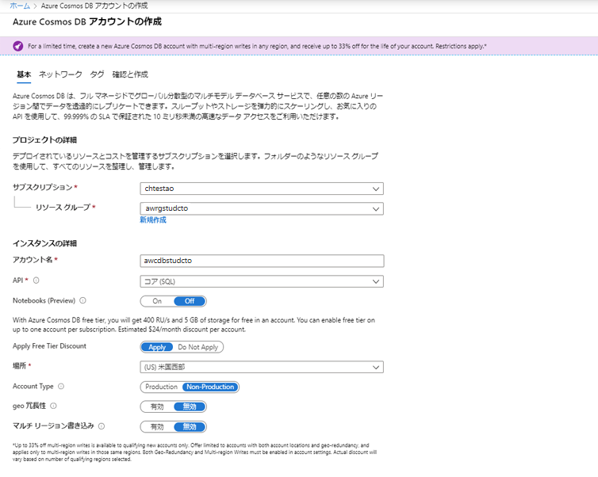
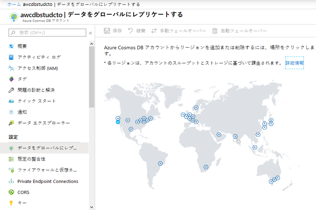
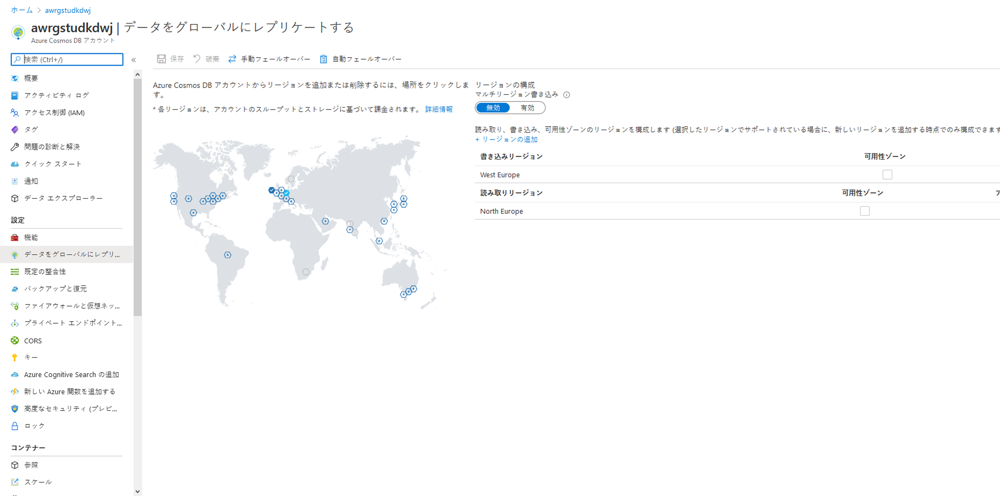

# DP 200 - データ プラットフォーム ソリューションの実装
# ラボ 4 - Cosmos DB を使用したグローバル分散データベースの構築

**推定時間**: 60 分

**前提条件**: このラボのケース スタディは既に確認していることを前提としています。モジュール 1: 「データ エンジニアのための Azure」の内容とラボを完了していることも前提としています。

**ラボ ファイル**: このラボのファイルは、_Allfiles\Labfiles\Starter\DP-200.4_ フォルダーにあります。

## ラボの概要

受講者は、Azure Cosmos DB が組織にもたらす機能について理解します。Cosmos DB インスタンスを作成し、ポータルと .Net アプリケーションを介してデータをアップロードおよびクエリする方法を習得します。続いて、Cosmos DB データベースのグローバル スケールを有効にする方法を習得します。

## ラボの目的
  
このラボを完了すると、次のことができるようになります。

1. スケーリングするようにビルドされた Azure Cosmos DB データベースを作成する
2. Azure Cosmos DB データベースにデータを挿入し、クエリを実行する
3. Azure Cosmos DB を使用してデータをグローバルに分散させる

## シナリオ
  
AdventureWorks の開発者と情報サービス部門は、Azure で最近リリースされた Cosmos DB と呼ばれる新サービスが、ほぼリアルタイムでデータへのアクセスを地球規模で提供できることを知りました。このサービスが提供する機能を理解し、どのような価値を、どのような状況で AdventureWorks にもたらすのか理解したいと考えています。

情報サービス部門では、サービスのセットアップ方法とデータのアップロード方法を理解したいと考えています。開発者は、Cosmos DB にデータをアップロードするために使用できるアプリケーションの例を知りたいと考えています。どちらも、地球規模で発生する要求がどのように満たされるのかを理解したいと考えています。

このラボでは、次のことを行います。

1. スケーリングするようにビルドされた Azure Cosmos DB データベースを作成する
2. Azure Cosmos DB データベースにデータを挿入し、クエリを実行する
3. Azure Cosmos DB を使用してデータをグローバルに分散させる

> **重要**: このラボを進める中で発生したプロビジョニングまたは構成タスクの問題については、メモに書き留め、_\Labfiles\DP-200-Issues-Docx_にあるドキュメントの表に記録してください。ラボ番号、テクノロジ、発生した問題、解決した方法を記述しておきます。このドキュメントは、後のモジュールで参照できるように保存します。

## 演習 1: スケーリングするようにビルドされた Azure Cosmos DB データベースを作成する

推定時間: 10 分

個別演習
  
この演習の主なタスクは、以下の通りです。

1. Azure Cosmos DB インスタンスを作成します。

### タスク 1: Azure Cosmos DB インスタンスを作成する

1. Azure portal で、必要に応じ、「**ホーム**」 ハイパーリンクをクリックします。

2. 「**リソースの作成**」 アイコンに移動します。

3. 「新規」 画面で、「**マーケットプレースの検索**」 テキスト ボックスをクリックし、「**Cosmos**」という単語を入力します。表示される一覧の 「**Azure Cosmos DB**」 をクリックします。

4. 「**Azure Cosmos DB**」 画面で 「**作成**」 をクリックします。

5. 「**Azure Cosmos DB アカウントの作成**」 画面から、次の設定を使用して Azure Cosmos DB アカウントを作成します。

    - 画面のプロジェクト詳細で、以下の情報を入力します。
    
        - **サブスクリプション**: このラボで使用するサブスクリプションの名前

        - **リソース グループ**: **awrgstudxx** (**xx** は自分のイニシャル)

    - 画面のインスタンスの詳細で、次の情報を入力します。

        - **アカウント名**: **Warehousexx** (**xx** は自分のイニシャル)

        - **API**: **Core(SQL)**

        - **Notebooks (プレビュー)**: **オフ**

        - **場所**: ラボの場所に最も近い Azure リージョンの名前と、Azure VM をプロビジョニングできる場所。

        - 残りのオプションは既定値のままにしておきます。

            

6. 「**Azure Cosmos DB アカウントの作成**」 ブレードで 「 **レビューと作成**」 をクリックします。

7. 「**Azure Cosmos DB アカウントの作成**」 ブレードの検証後、「**作成**」 をクリックします。

   > **注**: プロビジョニングの所要時間は約 5 分です。これらのエクササイズでは、Azure でサービスをプロビジョニングする際の追加のタブの説明は省略されています。プロビジョニング画面には、「ネットワーク」、「タグ」、「詳細」 などの追加のタブが表示されることがあります。これにより、サービスに対してカスタマイズした設定を定義できます。たとえば、多くのサービスの 「ネットワーク」 タブを使用すると、仮想ネットワークの構成を定義できるため、特定のデータ サービスに対してネットワーク トラフィックを制御および保護することができます。タグ オプションは、名前と値のペアになっており、複数のリソースおよびリソース グループに同じタグを適用して、リソースを分類し、統合した請求先を表示することができます。「詳細」 タブは、タブのあるサービスによって異なります。ただし、これらの領域を制御し、ネットワーク管理者や財務部門と協力したり、これらのオプションの構成方法を確認したりする必要がある点に注意することが重要です。

8. プロビジョニングが完了すると、「デプロイが完了しました」という画面が表示されます。**リソースに移動** をクリックして次の演習に進みます。 

>**結果**この演習では、Azure Cosmos DB アカウントのプロビジョニングを実行しました。

## 演習 2: Azure Cosmos DB データベースにデータを挿入し、クエリを実行する
  
推定時間: 20 分

個別演習
  
この演習の主なタスクは次のとおりです。

1. Azure Cosmos DB データベースとコンテナーを設定します。 

2. ポータルを使用してデータを追加します。

3. Azure ortal でクエリを実行します。

4. データに対して複雑な操作を実行します。

### タスク 1: Azure Cosmos DB コンテナーとデータベースをセットアップする

1. Azure portal で、Cosmos DBのデプロイが完了しましたというメッセージが表示されたら、「**リソースに移動**」 をクリックします。

2. Cosmos DB 画面で 「**概要**」 リンクをクリックします。

3. 「**awcdbstudxx**」 画面で、「**+ コンテナーの追加**」 をクリックします。「**コンテナーの追加**」 ブレードで 「**awcdbstudxx データ エクスプローラー**」 画面が開きます。

4. 「**コンテナーの追加**」 ブレードで、次の設定で「衣料品」という名前のコンテナーを含む製品データベースを作成します。

    - **データベース ID**: **Products**
    
    - **スループット**:  **400**

    - **コンテナーid**:  **Clothing**

    - **パーティション キー**: **/productId**

    - 残りのオプションは既定値のままにしておきます。

        

5. 「**コンテナーの追加**」 画面で、**OK** をクリックします。

### タスク 2: ポータルを使用してデータを追加する

1. 「**awcdbstudcto - データ エクスプローラー**」 画面で、データ エクスプローラー ツールバーの 「新規コレクション」 ボタンの反対側で、「**全画面表示**」 ボタンをクリックします。「全画面表示」 ダイアログ ボックスで、「**開く**」 をクリックします。Microsoft Edge で新しいタブが開きます。

2. 「**SQLAPI**」 ペインで、更新アイコンをクリックし、「**商品**」 を展開して 「**服**」 をクリックし、「**アイテム**」 をクリックします。 

3. 「ドキュメント」 ペインで、「**新規アイテム**」 のアイコンをクリックします。新しいドキュメントが表示され、置き換えるサンプル JSON が表示されます。

4. 次のコードをコピーし、**ドキュメント** タブに貼り付けます。

    ```JSON
    {
       "id": "1",
       "productId": "33218896",
       "category": "Women's Clothing",
       "manufacturer": "Contoso Sport",
       "description": "Quick dry crew neck t-shirt",
       "price": "14.99",
       "shipping": {
           "weight": 1,
           "dimensions": {
           "width": 6,
           "height": 8,
           "depth": 1
          }
       }
    }
    ```

    

5. 「ドキュメント」 タブに JSON を追加したら、「**保存**」 をクリックします。

6. 「ドキュメント」 ペインで、「**新規アイテム**」 のアイコンをクリックします。

7. 次のコードをコピーし、「**アイテム**」 タブに貼り付けます。

    ```JSON
    {
        "id": "2",
        "productId": "33218897",
        "category": "Women's Outerwear",
        "manufacturer": "Contoso",
        "description": "Black wool pea-coat",
        "price": "49.99",
        "shipping": {
            "weight": 2,
            "dimensions": {
            "width": 8,
            "height": 11,
            "depth": 3
            }
        }
    }
    ```

    

7. 「ドキュメント」 タブに JSON を追加したら、「**保存**」 をクリックします。

8. 左側のメニューで各ドキュメントをクリックすると、保存された各ドキュメントを表示することができます。productid にちなんだ名前の 1 の ID を持つ最初のアイテムの値は **33218896** となり、2 番目のアイテムの場合は **33218897** となります

### タスク 3: Azure portal でクエリを実行する

1. 開いた Microsoft Edgeブラウザーで、データ エクスプローラーの 「**アイテム**」 画面にある、「**SQL API**」 ブレード、「**更新**」 アイコンの上にある 「**新規 SQL クエリ**」 ボタンをクリックします。

    > **注**: クエリ 1 画面タブが表示され、クエリ **SELECT * FROM c** が表示されます。

2. productId 1 の詳細を示す JSON ファイルを返すクエリを記述します。

    ```SQL
    SELECT *
    FROM Products p
    WHERE p.id ="1"
    ```

3. 「**Execute Query**」 (クエリの実行) アイコンをクリックします。次の結果が返されます。

    ```JSON
    [
        {
            "id": "1",
            "productId": "33218896",
            "category": "Women's Clothing",
            "manufacturer": "Contoso Sport",
            "description": "Quick dry crew neck t-shirt",
            "price": "14.99",
            "shipping": {
                "weight": 1,
                "dimensions": {
                    "width": 6,
                    "height": 8,
                    "depth": 1
                }
            },
            "_rid": "I2YsALxG+-EBAAAAAAAAAA==",
            "_self": "dbs/I2YsAA==/colls/I2YsALxG+-E=/docs/I2YsALxG+-EBAAAAAAAAAA==/",
            "_etag": "\"0000844e-0000-1a00-0000-5ca79f840000\"",
            "_attachments": "attachments/",
            "_ts": 1554489220
        }
    ]
    ```

    

4. 既存のクエリ ウィンドウで、前のクエリを置き換えて、productId の JSON ファイルに id、製造元、説明を返すクエリを記述します。 

    ```SQL
    SELECT
        p.id,
        p.manufacturer,
        p.description
    FROM Products p
    WHERE p.id ="1"
    ```

5. 「**Execute Query**」 (クエリの実行) アイコンをクリックします。次の結果が返されます。

    ```JSON
    [
    {
        "id": "1",
        "manufacturer": "Contoso Sport",
        "description": "Quick dry crew neck t-shirt"
    }
    ]
    ```

    

6. 既存のクエリ ウィンドウで、前のクエリを置き換えて、価格順に並べ替えられたすべての製品の価格、説明、および製品 ID を昇順に返すクエリを記述します。

    ```SQL
    SELECT p.price, p.description, p.productId
    FROM Products p
    ORDER BY p.price ASC
    ```

7. 「**Execute Query**」 (クエリの実行) アイコンをクリックします。次の結果が返されます。

    ```JSON
    [
        {
            "price": "14.99",
            "description": "Quick dry crew neck t-shirt",
            "productId": "33218896"
        },
        {
            "price": "49.99",
            "description": "Black wool pea-coat",
            "productId": "33218897"
        }
    ]
    ```

    

### タスク 4: データに対して複雑な操作を実行する

1. 開いた Microsoft Edge ブラウザーで、データ エクスプローラーの 「**アイテム**」 画面にある 「**新規のストアド プロシージャ**」 ボタンをクリックします。これは、オープン クエリのボタンの横にあります。

    > **注**: サンプルのストアド プロシージャを示す新しいストアド プロシージャ画面が表示されます。

2. 「新規ストアド プロシージャ」 画面で、「**ストアド プロシージャ ID**」 テキスト ボックスに「**createMyDocument**」と入力します。

3. 次のコードを使用して、ストアド プロシージャ本体にストアド プロシージャを作成します。

    ```Javascript
    function createMyDocument() {
        var context = getContext();
        var collection = context.getCollection();

        var doc = {
            "id": "3",
            "productId": "33218898",
            "description": "Contoso microfleece zip-up jacket",
            "price": "44.99"
        };

        var accepted = collection.createDocument(collection.getSelfLink(),
            doc,
            function (err, documentCreated) {
                if (err) throw new Error('Error' + err.message);
                context.getResponse().setBody(documentCreated)
            });
        if (!accepted) return;
    }
    ```

4. 「新規ストアド プロシージャ」 画面で、「**保存**」 をクリックします。

5. 「新規ストアド プロシージャ」 画面で、「**実行**」 をクリックします。

6. 「入力パラメーター」 画面で、「**パーティション キーの値**」 を設定し、「**タイプ**」 を 「**文字列**」 に、「**値**」 を「**33218898**」に設定し、他の設定はそのままにして、「**実行**」 をクリックします。

次を参照してください。


次の結果が返されます。

    ```JSON
    {
        "id": "3",
        "productId": "33218898",
        "description": "Contoso microfleece zip-up jacket",
        "price": "44.99",
        "_rid": "I2YsALxG+-EDAAAAAAAAAA==",
        "_self": "dbs/I2YsAA==/colls/I2YsALxG+-E=/docs/I2YsALxG+-EDAAAAAAAAAA==/",
        "_etag": "\"0000874e-0000-1a00-0000-5ca7a7050000\"",
        "_attachments": "attachments/"
    }
    ```

7. 開いた Microsoft Edge ブラウザーで、データ エクスプローラーの 「**新規のストアド プロシージャ**」 のドロップ ダウン ボタンをクリックして 「**新規の UDF**」 をクリックします。

    > **注**: **関数 userDefinedFunction(){}** を示す新しい UDF 1 画面が表示されます。

8. 「新規定義関数」 画面で、「**ユーザー定義関数 ID**」 テキスト ボックスに「**producttax**」と入力します。

9. 次のコードを使用して、ユーザー定義関数本体にユーザー定義関数を作成します。

    ```Javascript
    function producttax(price) {
        if (price == undefined) 
            throw 'no input';

        var amount = parseFloat(price);

        if (amount < 1000) 
            return amount * 0.1;
        else if (amount < 10000) 
            return amount * 0.2;
        else
            return amount * 0.4;
    }
    ```

10. 「新規 UDF 1」 画面で、「**保存**」 をクリックします。

11. 「クエリ 1」 タブをクリックし、既存のクエリを次のクエリに置き換えます。

    ```SQL
    SELECT c.id, c.productId, c.price, udf.producttax(c.price) AS producttax FROM c
    ```

12. 「クエリ 1」 画面で、「**クエリの実行**」 をクリックします。

次の結果が返されます。

    ```JSON
    [
        {
            "id": "1",
            "productId": "33218896",
            "price": "14.99",
            "producttax": 1.499
        },
        {
            "id": "2",
            "productId": "33218897",
            "price": "49.99",
            "producttax": 4.9990000000000005
        },
        {
            "id": "3",
            "productId": "33218898",
            "price": "44.99",
            "producttax": 4.4990000000000005
        }
    ]
    ```

## 演習 3: Azure Cosmos DB を使用してデータをグローバルに分散させる

推定時間: 15 分

個別演習

この演習の主なタスクは次のとおりです。

1. データを複数のリージョンに複製します。

2. フェールオーバーを管理します。

### タスク 1: データを複数のリージョンに複製する

1. Azure portal で 「Cosmos DB リソース **awcdbstudxx**」 画面に移動し、「**設定**」 ブレードで 「**データをグローバルにレプリケートする**」 をクリックします。

    

2. 世界地図上で、自分が居住する大陸のデータ センターの場所を一回クリックし、「**保存**」 をクリックします。

>**注** 追加のデータ センターのプロビジョニングには約 7 分かかります。

### タスク 2: フェールオーバーを管理する

1. 「**awcdbstudxx - データをグローバルに複製**」 画面で、「**手動フェールオーバー**」 をクリックします。

2. 「**読み取りリージョン**」 データセンターの場所をクリックし、「現在の書き込みリージョンに対してフェールオーバーをトリガーすることを理解したうえで同意します」 の横にあるチェック ボックスをオンにし、「**OK**」 をクリックします。

>**注** 手動フェールオーバーには約 3 分かかります。画面は次のようになります。アイコンの色が変わったことに注意してください。



3. 「**awcdbstudxx - データをグローバルに複製**」 ウィンドウで、「**自動フェールオーバー**」 をクリックします。

4. 「自動フェールオーバー」 画面で、「**オン**」 をクリックし、「**OK**」 をクリックします。

>**注** 自動フェールオーバーのプロビジョニングには約 3 分かかります。


