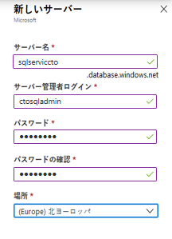
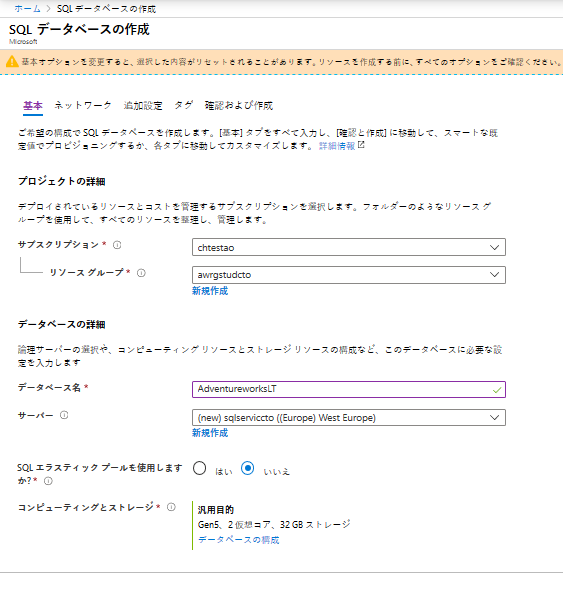
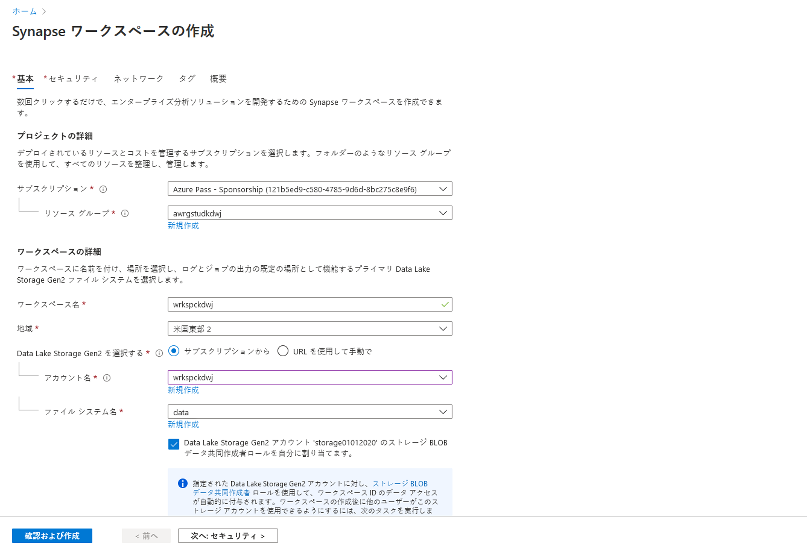
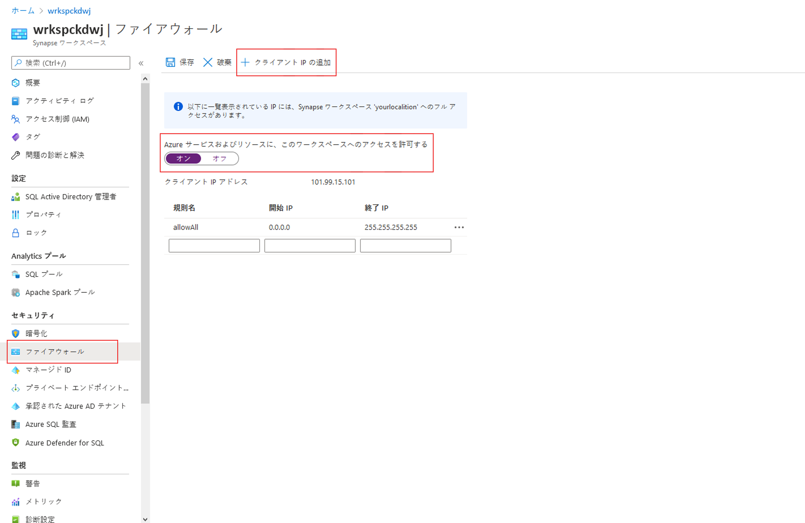
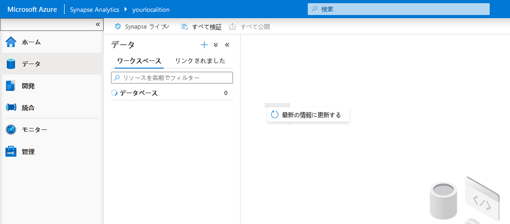

# DP 200 - データ プラットフォーム ソリューションの実装
# ラボ 5 - クラウドのリレーショナル データ ストアの使用

**推定時間**: 75 分

**前提条件**: このラボのケース スタディは既に確認していることを前提としています。モジュール 1: 「データ エンジニアのための Azure」の内容とラボを完了していることも前提としています。

**ラボ ファイル**: このラボのファイルは、_Allfiles\Labfiles\Starter\DP-200.5_ フォルダーにあります。

## ラボの概要

受講者は、Azure SQL Database と Azure Synapse Analytics サーバーをプロビジョニングし、作成したインスタンスの 1 つに対してクエリを発行します。また、SQL Data Warehouse を他の複数のデータ プラットフォーム テクノロジーと統合し、PolyBase を使用して 1 つのデータ ソースから Azure Synapse Analytics にデータを読み込みます。

## ラボの目的
  
このラボを完了すると、次のことができるようになります。

1. Azure SQL Database を使用する
2. Azure Synapse Analytics について説明する 
3. Azure Synapse Analytics を作成してクエリを実行する 
4. PolyBase を使用して Azure Synapse Analytics にデータを読み込む 

## シナリオ
  
あなたは AdventureWorks のシニア データ エンジニアであり、チームで協力して、リレーショナル データベース システムをオンプレミスの SQL Server から Azure にある Azure SQL Database に移行します。まず、会社のサンプル データベースを使用して Azure SQL Database のインスタンスを作成します。あなたは、このインスタンスを後輩のデータ エンジニアに託して、部門のデータベースのテストを実行してほしいと考えています。

次に、SQL Synapse Analytics サーバーをプロビジョニングし、一連のクエリを使用してサンプル データベースをテストすることで、サーバーのプロビジョニングが成功したことをテストします。さらに、このデータ プラットフォーム テクノロジと Azure Synapse Analytics が統合したことをテストするために、PolyBase を使用して Azure BLOB からディメンション テーブルを読み込みます。

このラボでは、次のことを行います。

1. Azure SQL Database を使用する
2. Azure Synapse Analytics について理解する 
3. Azure Synapse Analytics を作成してクエリを実行する 
4. PolyBase を使用して Azure Synapse Analytics にデータを読み込む 

> **重要**: このラボを進める中で発生したプロビジョニングまたは構成タスクの問題については、メモに書き留め、_\Labfiles\DP-200-Issues-Docx_にあるドキュメントの表に記録してください。ラボ番号、テクノロジ、発生した問題、解決した方法を記述しておきます。このドキュメントは、後のモジュールで参照できるように保存します。

## 演習 1: Azure SQL Database を使用する

推定時間: 15 分

個別演習
  
この演習の主なタスクは、以下の通りです。

1. SQL Database インスタンスを作成して構成します。

### タスク 1: SQL Database インスタンスを作成して構成する

1. Azure portal で、「**+ リソースを作成する**」 ブレードに移動します。

2. 「新規」 画面で、「**マーケット プレースの検索**」 テキスト ボックスをクリックし、「**SQL Database**」という単語を入力します。表示される一覧で 「**SQL Database**」 をクリックします。

3. 「**SQL Database**」 画面で、「**作成**」 をクリックします。

4. 「**SQL Database の作成**」 画面から、次の設定を使用して Azure SQL Database を作成します。

    - 「プロジェクトの詳細」 セクションで、次の情報を入力します。
    
        - **サブスクリプション**: このラボで使用するサブスクリプションの名前

        - **リソース グループ**: **awrgstudxx** (**xx** は自分のイニシャル)。

    - 「**追加設定**」 タブをクリックし、「**サンプル**」 をクリックします。AdventureworksLT サンプル データベースが自動的に選択されます。 
    
    - これが完了したら、「**基本**」 タブをクリックします。
    
    - 「データベースの詳細」 セクションで、次の情報を入力します。
    
        - データベース名: 「**AdventureworksLT**」と入力します。
     
        - サーバー: 次の設定で 「**新規作成**」 をクリックして新しいサーバーを作成し、**OK** をクリックします。
            - **サーバー名**: **sqlservicexx** (**xx** は自分のイニシャル)
            - **サーバー管理者のログイン**: **xxsqladmin** (**xx** は自分のイニシャル)
            - **パスワード**: **Pa55w.rd**
            - **パスワードを確認**: **Pa55w.rd**
            - **場所**: 近くの**場所**を選択します。
            - **OK** をクリックします。

                

            - その他の設定は既定のままにして、**OK** をクリックします。
            

    

5. 「**SQL Database の作成**」 ブレードで、「**レビューと作成**」 をクリックします。

6. 「**SQL Database の作成***」 ブレードの検証後、「**作成**」 をクリックします。

   > **注**: プロビジョニングの所要時間は約 4 分です。

> **結果**: この演習を完了すると、Azure SQL Database インスタンスが作成されます。

## 演習 2: Azure Synapse Analytics について理解する
  
推定時間: 15 分

個別演習
  
この演習の主なタスクは次のとおりです。

1. Azure Synapse Analytics インスタンスを作成して構成します。

2. サーバー ファイアウォールを構成します。

3. ウェアハウス データベースを一時停止します。

### タスク 1: Azure Synapse Analytics インスタンスを作成して構成する

1. Azure portal 画面の左上にあるリンク 「**ホーム**」 をクリックします。

2. Azure portal で、「**+ リソースの作成**」 をクリックします。

3. 「新規」 ブレードで、「**マーケット プレースの検索**」 テキスト ボックスに移動し、「**Synapse**」という単語を入力します。表示される一覧の 「**Azure Synapse Analytics**」 をクリックします。

4. 「**Azure Synapse Analytics**」 ブレードで、「**作成**」 をクリックします。

5. 「**Synapse ワークスペースの作成** **基本**」 ブレードで、次の設定を使用して Azure Synapse Analytics Workspace を作成します。

    - 「プロジェクトの詳細」 セクションで、次の情報を入力します。

        - **サブスクリプション**: このラボで使用するサブスクリプションの名前。

        - **リソース グループ**: **awrgstudxx** (**xx** は自分のイニシャル)。

    - ワークスペース詳細セクションで、以下の設定を使用してワークスペースを作成します。
        
        - **「ワークスペース名」**: **wrkspcxx** (**xx** は自分のイニシャル)。
        - **リージョン**: 最寄りの地域とリソースグループをデプロイした場所を選択します。
        - **Data Lake Storage Gen2 の選択**: 「サブスクリプションから」
        - **アカウント名**: **awdlsstudxx** を選択します (**xx** は自分のイニシャル)。
        - **ファイルシステム名**: **データ** を選択します。
        - 「Data Lake Storage Gen 2 アカウント「awdlsstudxx」の Storage BLOB Data Contributor の役割を自分に割り当てる」のチェックボックスをクリックします。 

         

    - 「**Synapse ワークスペースの作成**」 ブレードで、「**セキュリティ**」 タブに移動します。 

    - SQL 管理者の資格情報セクションで以下の情報を入力します。
        - **パスワード**: **Pa55w.rd**
        - **パスワードを確認**: **Pa55w.rd**
        - 他の設定はすべて **規定値** のままにします。 

    - 画面上で 「**レビューと作成**」 をクリックします。
    - このブレードで **「作成」** をクリックします。

   > **注**: プロビジョニングの所要時間は約 7 分です。

6. プロビジョニングが完了したら、**「リソースに移動」** を選択すると、Azure Synapse Analytics ワークスペースの 「**概要**」 ページが開きます。  

7. 「**新しい専用 SQL プール**」 を選択します。

8.. 「**専用 SQL プールの作成**」 ブレードの 「**基本**」 ページで、次の設定を構成します。
        - 専用 SQL プール名: **dedsqlxx** (**xx** は自分のイニシャル)
        - 他の設定はすべて規定値のままにします。

9. 「**専用 SQL プールの作成**」 画面で、「**レビューと作成**」 をクリックします。

10. 「**専用 SQL プールの作成**」 ブレードで、**「作成」** をクリ ックします。
  

   > **注**: プロビジョニングの所要時間は約 7 分です。

### タスク 2: サーバー ファイアウォールを構成する

1. Azure portal のブレードで、「**リソース グループ**」、「**awrgstudxx**」、「**wrkspcxx**」 をクリックします (**xx**は自分のイニシャル)。

2. 「**Wrkspcxx**」 画面で、「**ファイアウォール**」 をクリックします。

3. 「**wrkspcxx**- ファイアウォール」 画面で、「**+ クライアント IP の追加**」 オプションをクリックし、「**Azure サービスとリソースのこのワークスペースへのアクセスを許可する**」 が 「**オン**」 に設定されていることを確認してから、「**保存**」 をクリックします。正常に設定されたことを示す画面で、**OK** をクリックします。

    

    > **注**: サーバーのファイアウォール規則が正常に更新されたことを示すメッセージを受け取ります。

4. ファイアウォール画面を閉じます。

> **結果**: この演習を完了すると、Azure Synapse Analytics インスタンスが作成され、サーバー ファイアウォールを構成して、それに対する接続を有効にします。

### タスク 3: **dedsqlxx** 専用SQLプールを一時停止する

1. リソース グループで 「**dedsqlxx**」 リソースに移動します。 

2. 「**dedsqlxx**」 (**xx** は自分のイニシャル) をクリックします。

3. 「**dedsqlkxx (wrkspcxx/dedsqlxx)**」 画面で、「**一時停止**」 をクリックします。

4. 「**dedsqlxx** の一時停止」 画面で、「**はい**」 をクリックします。


## 演習 3: Azure Synapse Analytics データベースとテーブルを作成する

推定時間: 25 分

個別演習

この演習の主なタスクは次のとおりです。

1. Synapse Studio を理解し、専用 SQL プールに接続します。

2. 専用 SQL プール データベースを作成します。

3. 専用 SQL プール テーブルを作成します。

    > **注**: Transact-SQL に慣れていない場合は、以降のラボで使用できるステートメントが「**Allfiles\Labfiles\Starter\DP-200.5\SQL DW Files**」にあります。

### タスク 1: 専用 SQL プールを Azure Synapse Studio に接続する

1. リソース グループで 「**dedsqlxx**」 リソースに移動します。 

2. 「**概要**」 セクションで、「**Synapse Studio の起動**」 に移動します。

3. 画面左側の 「**データ ハブ**」 をクリックします。

4. 「**dedsqlxx**」 プールを開きます。 

5. 「**dedsqlxx**」 プールの横にある省略記号を選択します。 

6. 「**新しい SQL スクリプト**」、「**空のスクリプト**」 を選択します。

    


7. クエリ画面で、「**DWDB**」という名前のデータベースを作成する以下のクエリを貼り付け、サービス目標を DW100 に、最大サイズを 1024 GB に設定します。

    ```SQL
    CREATE DATABASE DWDB COLLATE SQL_Latin1_General_CP1_CI_AS
    (
        EDITION             = 'DataWarehouse'
    ,   SERVICE_OBJECTIVE   = 'DW100C'
    ,   MAXSIZE             = 1024 GB
    );
    ```

8. **「データベースの使用」** に移動して **「マスター」** を選択します。 

9. **「実行」** をクリックします。 

 > **注**: データベースの作成には約 6 分かかります。

10. クエリが終了したら、「更新」 をクリックして、省略記号を開くときに、**「データベース」** に新しく作成されたデータベースに移動します。


### タスク 3: 専用 SQL プール テーブルを作成する

1. Synapse Studio で、「**データ ハブ**」 タブで省略記号を開くときに、「**データベース**」 にある新しく作成されたデータベースに移動します。「**DWDB**」 をクリックします。

2. 「**DWDB**」 データベースの横にある省略記号を選択します。

3. 「**新しい SQL スクリプト**」、「**空のスクリプト**」 を選択します。

    > **注**: Transact-SQL に慣れていない場合は、「**Exercise3 Task3Step2 script.sql**」という名前のスクリプトが Allfiles\Solution\DP-200.5\folder にあります。テーブルの作成に必要なコードの大部分が含まれていますが、各テーブルに使用する配分タイプを選択してコードを完成させる必要があります。 

4. 以下の列に**複製**が分布した「**クラスター化された列ストア**」インデックスを有する「**dbo.Users**」という名前のテーブルを作成します。

    | 列名 | データ型 | NULL 値の許容|
    |-------------|-----------|------------|
    | userId | int | NULL|
    | City | nvarchar(100) | NULL|
    | Region | nvarchar(100) | NULL|
    | Country | nvarchar(100) | NULL|

      > **注**: スクリプトが **DWDB** に接続され、データベース **DWDB** を使用していることを確認します。 


5. **Synapse Studio** で、「**実行**」 をクリックすると、クエリが実行されます。**dbo.Users** テーブルが作成されたかどうかを確認するには、「更新」 をクリックして 「**テーブル**」 に移動し、展開するとテーブルが表示されます。 

6. Synapse Studio で、「**データ ハブ**」 タブで省略記号を開くときに、「**データベース**」 にある新しく作成されたデータベースに移動します。「**DWDB**」 をクリックします。

7. 「**DWDB**」 データベースの横にある省略記号を選択します。

8. 「**新しい SQL スクリプト**」、「**空のスクリプト**」 を選択します。

9. 以下の列に**ラウンド ロビン**が分布した「**クラスター化された列ストア**」インデックスを有する「**dbo.Products** 」という名前のテーブルを作成します。

    | 列名 | データ型 | NULL 値の許容|
    |-------------|-----------|------------|
    | ProductId | int | NULL|
    | EnglishProductName | nvarchar(100) | NULL|
    | Color | nvarchar(100) | NULL|
    | StandardCost | int | NULL|
    | ListPrice | int | NULL|
    | Size | nvarchar(100) | NULL|
    | Weight | int | NULL|
    | DaysToManufacture | int | NULL|
    | Class | nvarchar(100) | NULL|
    | Style | nvarchar(100) | NULL|

    > **注**: スクリプトが **DWDB** に接続され、データベース **DWDB** を使用していることを確認します。 

10. **Synapse Studio** で、「**実行**」 をクリックすると、クエリが実行されます。**dbo.Products** テーブルが作成されたかどうかを確認するには、「更新」 をクリックして 「**テーブル**」 に移動し、展開するとテーブルが表示されるはずです。 

11. Synapse Studio で、「**データ ハブ**」 タブで省略記号を開くときに、「**データベース**」 にある新しく作成されたデータベースに移動します。「**DWDB**」 をクリックします。

12. 「**DWDB**」 データベースの横にある省略記号を選択します。

13. 「**新しい SQL スクリプト**」、「**空のスクリプト**」 を選択します。

14. 以下の列の **SalesUnit** に**ハッシュ**が分布した「**クラスター化列ストア**」インデックスを有する **dbo.FactSales** という名前のテーブルを作成します。

    | 列名 | データ型 | NULL 値の許容|
    |-------------|-----------|------------|
    | DateId | int | NULL|
    | ProductId | int | NULL|
    | UserId | int | NULL|
    | UserPreferenceId | int | NULL|
    | SalesUnit | int | NULL|

    > **注**: スクリプトが **DWDB** に接続され、データベース **DWDB** を使用していることを確認します。 

15. **Synapse Studio** で、「**実行**」 をクリックすると、クエリが実行されます。**dbo.FactSales** テーブルが作成されたかどうかを確認するには、「更新」 をクリックして 「**テーブル**」 に移動し、展開するとテーブルが表示されるはずです。 

> **結果**: この演習を完了すると、Synapse Studio を使用して、DWDB という名前のデータ ウェアハウスと、Users、Products、FactSales という名前の 3 つのテーブルが作成されます。

## 演習 4: PolyBase を使用した Azure Synapse Analytics へデータを読み込む 

推定時間: 10 分

個別演習

この演習の主なタスクは次のとおりです。

1. Data Lake Storage コンテナーとキーの詳細を収集します。

2. Azure Data Lake Storage の PolyBase を使用して dbo.Dates テーブルを作成します。

### タスク 1: Azure BLOB アカウント名とキーの詳細を収集する

1. Azure portal で、「**リソース グループ」**」 をクリックしてから、「**awrgstudxx**」 をクリックし、次に 「**awdlsstudxx**」 をクリックします (xx は自分の名前のイニシャル)。

2. 「**awdlsstudxx**」 画面で、「**アクセス キー**」 をクリックします。「**ストレージ アカウント名**」 の横にあるアイコンをクリックし、メモ帳に貼り付けます。

3. 「**awdlsstudxx - アクセス キー**」 画面の 「**key1**」 で、「**キー**」 の横にあるアイコンをクリックし、メモ帳に貼り付けます。

### タスク 2: Azure BLOB から PolyBase を使用し、dbo.Dates テーブルを作成する

1. Synapse Studio で、「**データ ハブ**」 タブで省略記号を開くときに、「**データベース**」 にある新しく作成されたデータベースに移動します。「**DWDB**」 をクリックします。

2. 「**DWDB**」 データベースの横にある省略記号を選択します。

3. 「**新しい SQL スクリプト**」、「**空のスクリプト**」 を選択します。

4. **DWDB** データベースに対して**マスター キー**を作成します。クエリ エディターで、次のコードを入力します。

    ```SQL
    CREATE MASTER KEY;
    ```
    > **注**: スクリプトが **DWDB** に接続され、データベース **DWDB** を使用していることを確認します。 

5. **Synapse Studio** で、「**実行**」 をクリックすると、クエリが実行されます。

6. Synapse Studio で、「**データ ハブ**」 タブで省略記号を開くときに、「**データベース**」 にある新しく作成されたデータベースに移動します。「**DWDB**」 をクリックします。

7. 「**DWDB**」 データベースの横にある省略記号を選択します。

8. 「**新しい SQL スクリプト**」、「**空のスクリプト**」 を選択します。

9. 次のコードをクエリ エディターに入力して、次の詳細を含む、「**AzureStorageCredential**」という名前のデータベース スコープの資格情報を作成します。
    - ID: **MOCID**
    - シークレット: **ストレージ アカウントのアクセス キー**

    ```SQL
    CREATE DATABASE SCOPED CREDENTIAL AzureStorageCredential
    WITH
    IDENTITY = 'MOCID',
    SECRET = 'Your storage account key'
;
    ```
    > **注**: スクリプトが **DWDB** に接続され、データベース **DWDB** を使用していることを確認します。 

10. **Synapse Studio** で、「**実行**」 をクリックすると、クエリが実行されます。

11. Synapse Studio で、「**データ ハブ**」 タブで省略記号を開くときに、「**データベース**」 にある新しく作成されたデータベースに移動します。「**DWDB**」 をクリックします。

12. 「**DWDB**」 データベースの横にある省略記号を選択します。

13. 「**新しい SQL スクリプト**」、「**空のスクリプト**」 を選択します。

14. 「クエリ」 ウィンドウに、****AzureStorageCredential** を使用する **HADOOP** の種類で作成された BLOB ストレージ アカウントとデータ コンテナー用に **AzureStorage** という名前の外部データ ソースを作成するコードを入力します。場所キーの **awdlsstudxx** を自分のストレージ アカウントで自分のイニシャルに置き換える必要があります。 

    ```SQL
	CREATE EXTERNAL DATA SOURCE AzureStorage
    WITH (
        TYPE = HADOOP,
        LOCATION = 'abfs://data@awdlsstudxx.dfs.core.windows.net',
        CREDENTIAL = AzureStorageCredential
    );
    ```
    > **注**: スクリプトが **DWDB** に接続され、データベース **DWDB** を使用していることを確認します。 

15. **Synapse Studio** で、「**実行**」 をクリックすると、クエリが実行されます。

16. Synapse Studio で、「**データ ハブ**」 タブで省略記号を開くときに、「**データベース**」 にある新しく作成されたデータベースに移動します。「**DWDB**」 をクリックします。

17. 「**DWDB**」 データベースの横にある省略記号を選択します。

18. 「**新しい SQL スクリプト**」、「**空のスクリプト**」 を選択します。

19. 「クエリ」 ウィンドウに、formattype が **DelimitedText**、フィールド ターミネータが **コンマ**の **TextFile** という名前の外部ファイル形式を作成するコードを入力します。

    ```SQL
    CREATE EXTERNAL FILE FORMAT TextFile
    WITH (
        FORMAT_TYPE = DelimitedText,
        FORMAT_OPTIONS (FIELD_TERMINATOR = ',')
    );
    ```
    > **注**: スクリプトが **DWDB** に接続され、データベース **DWDB** を使用していることを確認します。 

20. **Synapse Studio** で、「**実行**」 をクリックすると、クエリが実行されます。

21. .Synapse Studio で、「**データ ハブ**」 タブで省略記号を開くときに、「**データベース**」 にある新しく作成されたデータベースに移動します。「**DWDB**」 をクリックします。

22. 「**DWDB**」 データベースの横にある省略記号を選択します。

23. 「**新しい SQL スクリプト**」、「**空のスクリプト**」 を選択します。   

24. 「クエリ」 ウィンドウに、**場所** がルート ファイル、データ ソースが **AzureStorage**、File-format が **TextFile** で次の列を有する **dbo.DimDate2External** という名前の外部テーブルを作成するコードを入力します。

    | 列名 | データ型 | NULL 値の許容|
    |-------------|-----------|------------|
    | Date | datetime2(3) | NULL|
    | DateKey | decimal(38, 0) | NULL|
    | MonthKey | decimal(38, 0) | NULL|
    | Month | nvarchar(100) | NULL|
    | Quarter | nvarchar(100) | NULL|
    | Year | decimal(38, 0) | NULL|
    | Year-Quarter | nvarchar(100) | NULL|
    | Year-Month | nvarchar(100) | NULL|
    | Year-MonthKey | nvarchar(100) | NULL|
    | WeekDayKey| decimal(38, 0) | NULL|
    | WeekDay| nvarchar(100) | NULL|
    | Day Of Month| decimal(38, 0) | NULL|

    ```SQL
	CREATE EXTERNAL TABLE dbo.DimDate2External (
    [Date] datetime2(3) NULL,
    [DateKey] decimal(38, 0) NULL,
    [MonthKey] decimal(38, 0) NULL,
    [Month] nvarchar(100) NULL,
    [Quarter] nvarchar(100) NULL,
    [Year] decimal(38, 0) NULL,
    [Year-Quarter] nvarchar(100) NULL,
    [Year-Month] nvarchar(100) NULL,
    [Year-MonthKey] nvarchar(100) NULL,
    [WeekDayKey] decimal(38, 0) NULL,
    [WeekDay] nvarchar(100) NULL,
    [Day Of Month] decimal(38, 0) NULL
    )
    WITH (
        LOCATION='/DimDate2.txt',
        DATA_SOURCE=AzureStorage,
        FILE_FORMAT=TextFile
    );
    ```
    > **注**: スクリプトが **DWDB** に接続され、データベース **DWDB** を使用していることを確認します。 


25. **Synapse Studio** で、「**実行**」 をクリックすると、クエリが実行されます。

26. Synapse Studio で、「**データ ハブ**」 タブで省略記号を開くときに、「**データベース**」 にある新しく作成されたデータベースに移動します。「**DWDB**」 をクリックします。

27. 「**DWDB**」 データベースの横にある省略記号を選択します。

28. 「**新しい SQL スクリプト**」、「**空のスクリプト**」 を選択します。  

29. テーブルに対して select ステートメントを実行して、テーブルが作成されたことをテストします。

    ```SQL
    SELECT * FROM dbo.DimDate2External;
    ```
> **注**: スクリプトが **DWDB** に接続され、データベース **DWDB** を使用していることを確認します。 


30. **Synapse Studio** で、「**実行**」 をクリックすると、クエリが実行されます。

31. Synapse Studio で、「**データ ハブ**」 タブで省略記号を開くときに、「**データベース**」 にある新しく作成されたデータベースに移動します。「**DWDB**」 をクリックします。

32. 「**DWDB**」 データベースの横にある省略記号を選択します。

33. 「**新しい SQL スクリプト**」、「**空のスクリプト**」 を選択します。  

34. 「クエリ」 ウィンドウに、**列ストア** インデックス、および **dbo.DimDate2External** テーブルからデータを読み込む **ラウンド ロビン** の **分布** を持つ **dbo.Dates** という名前のテーブルを作成する **CTAS** ステートメントを入力します。

    ```SQL
    CREATE TABLE dbo.Dates
    WITH
    (   
        CLUSTERED COLUMNSTORE INDEX,
        DISTRIBUTION = ROUND_ROBIN
    )
    AS
    SELECT * FROM [dbo].[DimDate2External];
    ```
> **注**: スクリプトが **DWDB** に接続され、データベース **DWDB** を使用していることを確認します。 

35. **Synapse Studio** で、「**実行**」 をクリックすると、クエリが実行されます。

36. Synapse Studio で、「**データ ハブ**」 タブで省略記号を開くときに、「**データベース**」 にある新しく作成されたデータベースに移動します。「**DWDB**」 をクリックします。

37. 「**DWDB**」 データベースの横にある省略記号を選択します。

38. 「**新しい SQL スクリプト**」、「**空のスクリプト**」 を選択します。  
 
39. 「クエリ」 ウィンドウに、**DateKey**、**Quarter**、**Month** 列の統計を作成するクエリを入力します。

    ```SQL
    CREATE STATISTICS [DateKey] on [Dates] ([DateKey]);
    CREATE STATISTICS [Quarter] on [Dates] ([Quarter]);
    CREATE STATISTICS [Month] on [Dates] ([Month]);
    ```
> **注**: スクリプトが **DWDB** に接続され、データベース **DWDB** を使用していることを確認します。 

40. **Synapse Studio** で、「**実行**」 をクリックすると、クエリが実行されます。

41. Synapse Studio で、「**データ ハブ**」 タブで省略記号を開くときに、「**データベース**」 にある新しく作成されたデータベースに移動します。「**DWDB**」 をクリックします。

42. 「**DWDB**」 データベースの横にある省略記号を選択します。

43. 「**新しい SQL スクリプト**」、「**空のスクリプト**」 を選択します。

44. テーブルに対して select ステートメントを実行して、テーブルが作成されたことをテストします。

    ```SQL
    SELECT * FROM dbo.Dates;
    ```
> **注**: スクリプトが **DWDB** に接続され、データベース **DWDB** を使用していることを確認します。

45. **Synapse Studio** で、「**実行**」 をクリックすると、クエリが実行されます。

