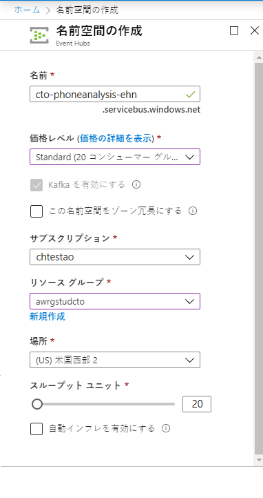
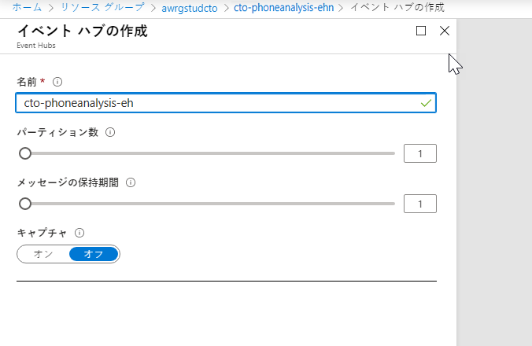
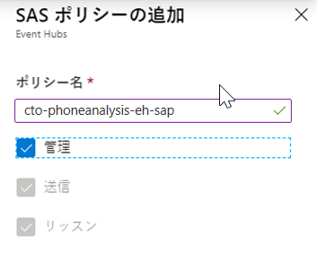
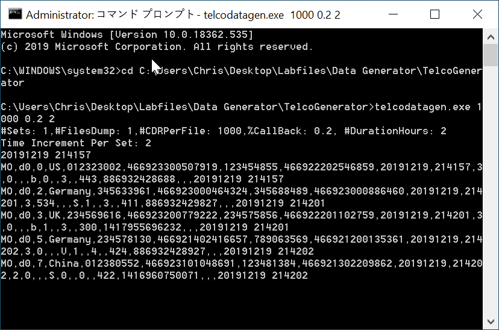
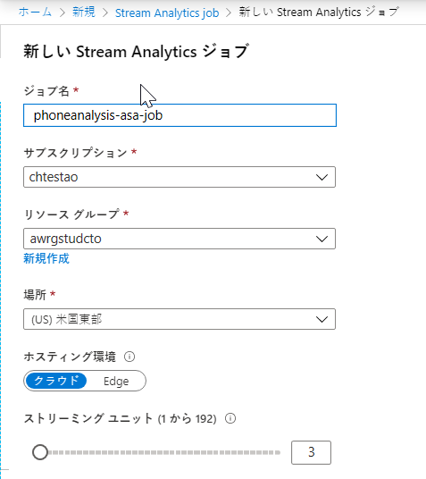
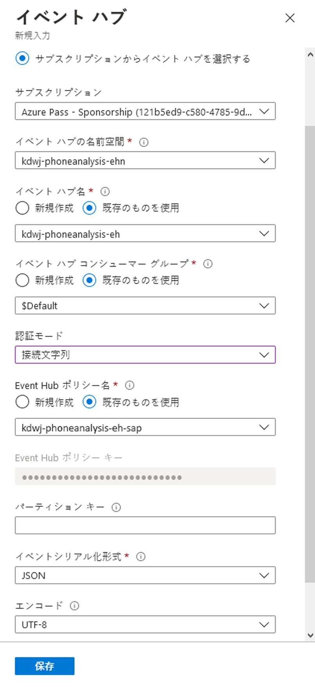
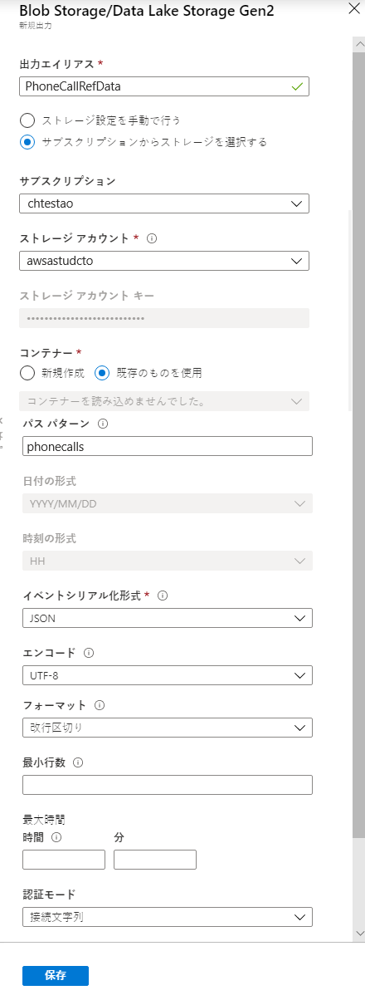
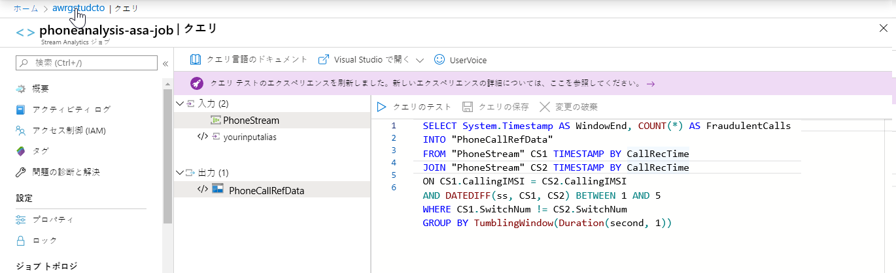
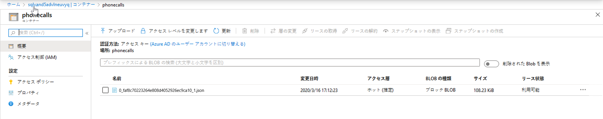

---
lab:
    title: 'Stream Analytics でのリアルタイム分析の実行'
    module: 'モジュール 6: Streaming Analytics を使用したリアルタイム分析の実行'
---

# DP 200 - データ プラットフォーム ソリューションの実装
# ラボ 6 - Stream Analytics でのリアルタイム分析の実行

**所要時間**: 60 分

**前提条件**: このラボのケース スタディは既に確認していることを前提としています。モジュール 1 の内容と課題は次のことを前提としています。データ エンジニアのための Azure も完了済みであることを前提としています。

**ラボ ファイル**: このラボのファイルは、_Allfiles\Labfiles\Starter\DP-200.6_のフォルダーにあります。

## ラボの概要

学生は、データ ストリームとは何か、またイベント処理がどう行われるかを説明し、AdventureWorks のケース スタディに適したデータ ストリーム インジェスト技術を選択できるようになります。選択したインジェスト テクノロジーをプロビジョニングし、これを Stream Analytics と統合して、ストリーミング データで動作するソリューションを作成します。

## ラボの目的
  
このラボを完了すると、次のことができるようになります。

1. データ ストリームとイベント処理について説明できる
1. Event Hubs でのデータ インジェスト
1. データ生成アプリケーションを開始する
1. Stream Analytics ジョブでのデータの処理

## シナリオ
  
デジタル変革プロジェクトの一環として、カスタマー サービス部門が不正な電話を特定するのを支援するために、あなたは CIO によって任命されました。ここ数年、カスタマーサービス部門は、保証対象ではない自転車や AdventureWorks で購入していない自転車のサポートを求めている詐欺的な顧客からの電話の増加を観察しました。 

同部門では現在、この情報を特定するために顧客サービス エージェントの対応に依存しています。その結果、彼らはエージェントがリアルタイムで誰が不正な要求をする可能性があるのかを追跡するシステムを実装したいと思います。

このラボを完了すると:

1. データ ストリームとイベント処理を説明した
1. Event Hubs を使用して取り込まれたデータ
1. データ生成アプリケーションを開始した
1. Stream Analytics ジョブを使用してデータを処理した

> **重要**: このラボを進めるにつれ、プロビジョニングまたは構成タスクで発生した問題を書き留め、_\Labfiles\DP-200-Issues-Docx_にあるドキュメントの表に記録してください。ラボ番号を記述し、テクノロジーを書き留め、その問題と解決内容を説明します。このドキュメントは、後のモジュールで参照できるように保存します。

## エクササイズ 1: データ ストリームとイベント処理について説明する

所要時間: 15 分

グループ エクササイズ
  
このエクササイズの主なタスク:

1. ケース スタディとシナリオから、AdventureWorks のデータ ストリーム インジェスト技術と、データ エンジニアとして実行する高レベルのタスクを特定して、ソーシャル メディア分析の要件を完了します。

1. インストラクターは、検出結果についてグループと話し合います。

### タスク 1: AdventureWorks のデータ要件と構造を特定する

1. 課題の仮想マシンから **Microsoft Word** を起動し、**Allfiles\Labfiles\Starter\DP-200.6** フォルダーからファイル **DP-200-Lab06-Ex01.docx** を開きます。

1. ケース スタディ ドキュメント内でグループが特定したデータ要件とデータ構造について、グループで **10 分間** 話し合い、書き出してもらいます。

### タスク 2：検出結果についてインストラクターと話し合う

1. インストラクターは、調査結果について話し合うためにグループ作業を中断させます。

> **結果**: このエクササイズを完了すると、データ ストリーミング インジェスト の結果としてのテーブルと、ソーシャル メディア分析要件を完了するためにデータ エンジニアとして指揮すべきハイレベルなタスクをまとめた Microsoft Word ドキュメントが完成します。

## エクササイズ 2: Event Hubs を使用したデータ インジェスト
  
所要時間: 15 分

個別エクササイズ
  
このエクササイズの主なタスクは次のとおりです。

1. イベント ハブ名前空間を作成して構成する。

1. イベント ハブを作成、構成します。

1. イベント ハブ のセキュリティを構成する。

### タスク 1: イベント ハブ名前空間を作成して構成する。

1. Azure portal で、画面左上の [**ホーム**] ハイパーリンクをクリックします。

1. Azure portal で、**リソースを作成** アイコンをクリックし、「**Event Hubs**」と入力し、検索結果から **Event Hubs** を選択します。Event Hubs 画面で [**作成**] をクリックします。

1. [名前空間の作成] ブレードで、次のオプションを入力します。
    - **名前**: **xx-phoneanalysis-ehn** (xx は自分のイニシャル)
    - **価格レベル**: **Standard**
    - **サブスクリプション**: **自分のサブスクリプション**
    - **リソース グループ**: **awrgstudxx**
    - **場所**: ユーザーに近い場所を選択します。
    - **スループット ユニット**: **20**
    - 他のオプションを既定の設定のままにします。

        

1. 次に [**作成**] をクリックします。

    > **注**: イベント ハブ名前空間の作成には約 1 分かかります。
   
### タスク 2: イベント ハブを作成して構成する。

1. Azure portal で、画面左上の [**ホーム**] ハイパーリンクをクリックします。

1. Azure portal のブレードで、**リソース グループ** をクリックし、**awrgstudxx** をクリックします (**xx** は自分のイニシャル)。

1. **xx-phoneanalysis-ehn** をクリックします (**xx** は自分のイニシャル)。

1. **xx-phoneanalysis-ehn** 画面で、[**+ Event Hubs**]をクリックします。

1. 「**xx-phoneanalysis-eh**」という名前を指定し、その他の設定はデフォルト値のままにして、[**作成**] を選択します。

    

    > **注**: 約 10 秒後に、イベント ハブが作成されたことを示すメッセージを受信します。

### タスク 3: イベント ハブ のセキュリティを構成する。

1. Azure portal の **xx-phoneanalysis-ehn** スクリーンでは、**xx** が自分のイニシャルとなります。ウィンドウの一番下までスクロールし、**xx-phoneanalysis-eh** イベント ハブをクリックします。

1. イベント ハブへのアクセスを許可するには、左側のブレードで [**共有アクセス ポリシー**] をクリックします。

1. **xx-phoneanalysis-eh - 共有アクセス ポリシー** 画面で、[**+ 追加**]を選択して、**管理** アクセス許可のポリシーを作成します。ポリシーに「**xx-phoneanalysis-eh-sap**」という名前を付け、[**管理**]をオンにしてから、[**作成**]をクリックします。

    

1. 作成後に新しいポリシー **xx-phoneanalysis-eh-sap** をクリックし、**接続文字列 – 主キー** のコピー ボタンをクリックして、メモ帳にこの「接続文字列 – 主キー」貼り付けます。これは後のエクササイズで使用します。

    >**注**: 接続文字列は次のようになります。
    > ```CMD
    >Endpoint=sb://<Your event hub namespace>.servicebus.windows.net/;SharedAccessKeyName=<Your shared access policy name>;SharedAccessKey=<generated key>;EntityPath=<Your event hub name>
    >```
    > 接続文字列には、セミコロンで区切られた複数のキーと値のペアが含まれていることに注意してください。エンドポイント、共有アクセス キー名、共有アクセス キー、およびエンティティ パス

1. portal のイベント ハブ画面を閉じます

> **結果**: このエクササイズを完了すると、イベント ハブ名前空間内に Azure Event Hub が作成され、サービスへのアクセスを提供する際に使用するイベント ハブのセキュリティが設定されます。

## エクササイズ 3: テレコム イベント ジェネレータ アプリケーションの起動

所要時間: 15 分

個別エクササイズ

このエクササイズの主なタスク:

1. アプリケーションの接続文字列を変更する

1. アプリケーションの実行

### タスク 1: アプリケーションの接続文字列を変更する

1. **Labfiles\Starter\DP-200.6\DataGenerator** を参照します。

1. **telcodatagen.exe.config** ファイルを、何らかのテキスト エディタで開きます。

1. 構成ファイルの<appSettings>要素を次のように更新します。

    - **EventHubName** キーの値、接続文字列の **EntityPath** の値を設定します。
    - **Microsoft.ServiceBus.ConnectionString** というキーの値に、接続文字列の **EntityPathを除いた値** を設定します (その前にあるセミコロンを取り除くのを忘れないでください)。

1. ファイルを保存します。

### タスク 2: アプリケーションを実行します。

1. Windows の [**スタート**] ボタンをクリックし 、「**CMD**」と入力します。 

1. [**コマンド プロンプト**] を右クリックし、[**管理者として実行**] をクリックします。ユーザーAccess Control 画面が表示されたら **はい** をクリックします。

1. コマンド プロンプトで カレント ディレクトリを **Labfiles\Starter\DP-200.6\DataGenerator** に移動します。

1. 次のコマンドを入力します。 

    ```CMD
    telcodatagen.exe 1000 0.2 2
    ```

    > 注: このコマンドは、次のパラメータを受け取ります。
1 時間あたりの通話データ レコード数。
不正な通話をシミュレートする頻度を示す、不正確率。0.2 という値は、通話レコードの約 20% が不正に見えるということを意味します。
時間 (アプリを実行する時間)。また、コマンド ラインでプロセスを終了 (Ctrl+C) することで、いつでもアプリを停止できます。

    

数秒後、アプリはイベント ハブに送信する通話レコードを画面に表示し始めます。通話データには、次のフィールドが含まれています。

|レコード | 定義 |
|-|-|
|CallrecTime |呼び出し開始時刻のタイムスタンプ。|
|SwitchNum |通話の接続に使われた電話交換機。この例では、スイッチは発信国/地域を表す文字列です (米国、中国、英国、ドイツ、オーストラリア)。|
|CallingNum |発信元の電話番号。|
|CallingIMSI |国際モバイル サブスクライバー ID (IMSI)これは、発信元の一意の識別子です。|
|CalledNum | 通話受信者の電話番号。|
|CalledIMSI| IMSI (International Mobile Subscriber Identity: 国際携帯機器加入者識別番号)。これは、通話受信者の一意の識別子です。|

1. コマンド プロンプト ウィンドウを最小化します。 

> [**結果**]: この演習を完了すると、コール センターが受信した通話データを生成するアプリケーションが形成されます。

## エクササイズ 4: Stream Analytics ジョブを使用したデータの処理

予想時間: 15 分

個別エクササイズ

このエクササイズの主なタスク:

1. Stream Analytics ジョブを用意する。

1. Stream Analytics ジョブの入力を指定する。

1. Stream Analytics ジョブの出力を指定します。

1. Stream Analytics クエリを定義します。

1. Stream Analytics ジョブを開始します。

1. ストリーミング データが収集されることを確認する

### タスク 1: Stream Analytics ジョブをプロビジョニングする。

1. Azure portal に戻り、**リソースの作成** アイコンに移動してクリックし、「**STREAM**」と入力したら、**Stream Analytics job**、[**作成**] の順にクリックします。

1. [**新しい Stream Analytics ジョブ**] スクリーンで、次のように詳細を入力し、[**作成**]をクリックします。
    - **ジョブ名**: phoneanalysis-asa-job
    - **サブスクリプション**: 自分のサブスクリプションを選択します
    - [**リソース グループ**]: awrgstudxx
    - **場所**: 最も近い場所を選択します。
    - その他のオプションは既定のままにします。

        

    > **注**: 約 10 秒後に、Stream Analytics ジョブが作成されたことを示すメッセージが表示されます。このデータが Azure portal に反映されるまで数分間かかる場合があります。

### タスク 2: Stream Analytics ジョブの入力を指定する。

1. Azure portal のブレードで、[**リソース グループ**] をクリックしてから、[**awrgstudxx**] をクリックします (**xx** は自分のイニシャル)。

1. **phoneanalysis-asa-job** をクリックします。

1. **phoneanalysis-asa-job** Stream Analytics ジョブ ウィンドウの左側のブレードで、[**ジョブ トポロジ**] の下の [**入力**] をクリックします。

1. [**入力**] 画面で、[**ストリーム入力の追加**] をクリックし、[**イベント ハブ**] をクリックします。

1. [イベント ハブ] 画面で、次の値を入力し、[**保存**] ボタンをクリックします。
    - **入力エイリアス**: このジョブ入力の名前として 「**PhoneStream**」 と入力します。
    - **サブスクリプションから Event Hub を選択する**: オン
    - **サブスクリプション**: 自分のサブスクリプション名
    - **イベント ハブ名前空間**: xx-phoneanalysis-ehn
    - **イベント ハブ名**: 既存の名前付き xx-phoneanalysis-eh を使用します
    - **イベント ハブ ポリシー名**: xx-phoneanalysis-eh-sap
    - 残りのエントリは既定値のままにしておきます。最後に、**保存*** をクリックします。

        

1. 完了したら、入力ウィンドウの下に **PhoneStream** 入力ジョブが表示されます。入力ウィンドウを閉じて、[リソース グループ] ページに戻ります。

### タスク 3: Stream Analytics ジョブの出力を指定する。

1. **phoneanalysis-asa-job** をクリックします。

1. **phoneanalysis-asa-job** Stream Analytics ジョブ ウィンドウの左側のブレードで、[**ジョブ トポロジ**] の下にある [**出力**] をクリックします。

1. **出力** 画面で、**追加** をクリックし、**Blob Storage** をクリックします。

1. **Blob Storage** ウィンドウで、ペインに次の値を入力または選択します。
    - **出力エイリアス**: **PhoneCallRefData**
    - **サブスクリプションからイベント ハブを選択**: オン
    - **サブスクリプション**: 自分のサブスクリプション名
    - **ストレージ アカウント**: **awsastudxx** (xx は自分のイニシャル)
    - **コンテナー**: [**既存のものを使用**]で、**phonecalls** 選択します
    - 残りのエントリは既定値のままにしておきます。最後に、[**保存**]をクリックします。

        

1. 出力画面を閉じて、[リソース グループ] ページに戻ります。

### タスク 4: Stream Analytics クエリを定義する。

1. **phoneanalysis-asa-job** をクリックします。

1. **phoneanalysis-asa-job** ウィンドウで、ウィンドウ中央の **クエリ** 画面で **クエリの編集** をクリックします。

1. コード エディタで次のクエリを置き換えます。

    ```SQL
    SELECT
        *
    INTO
        [YourOutputAlias]
    FROM
        [YourInputAlias]
    ```

1. Replace with

    ```SQL
    SELECT System.Timestamp AS WindowEnd, COUNT(*) AS FraudulentCalls
    INTO "PhoneCallRefData"
    FROM "PhoneStream" CS1 TIMESTAMP BY CallRecTime
    JOIN "PhoneStream" CS2 TIMESTAMP BY CallRecTime
    ON CS1.CallingIMSI = CS2.CallingIMSI
    AND DATEDIFF(ss, CS1, CS2) BETWEEN 1 AND 5
    WHERE CS1.SwitchNum != CS2.SwitchNum
    GROUP BY TumblingWindow(Duration(second, 1))
    ```

    > 注: このクエリは、5 秒の通話間隔で自己結合を実行します。不正な呼び出しをチェックするには、CallRecTime 値に基づいてストリーミング データを自己結合します。その後、CallingIMSI の値 (元の番号) は同じであるが、SwitchNum の値 (原産国/地域) が同じではない呼び出しレコードを探すことができます。ストリーミング データで JOIN 操作を使用する場合、一致する行と見なす最大時間差をJOINで制限する必要があります。ストリーミング データはエンドレスであるため、リレーションシップの時間範囲は、join の ON 句で DATEDIFF 関数を使って指定します。
    このクエリは、DATEDIFF 関数を除けば通常の SQL 結合とほぼ同じです。このクエリで使用される DATEDIFF 関数は、ストリーム分析に固有であり、ON...BETWEEN 句で使う必要があります。

    

1. [**クエリの保存**] を選択します。

1. [クエリ] ウィンドウを閉じて、Stream Analytics ジョブ ページに戻ります。


### タスク 5: Stream Analytics ジョブを開始する

1. **phoneanalysis-asa-job** ウィンドウで、ウィンドウ中央の **クエリ** 画面で **開始** をクリックします。
 
1. **ジョブの開始** ダイアログで、**現在** をクリックし、[**開始**]をクリックします。 

>**注記**: **phoneanalysis-asa-job** ウィンドウに、ジョブが開始された 1 分後にメッセージが表示され、開始フィールドが開始時刻に変更されます。

>**注**: データをキャプチャできるように、2 分間実行したままにします。

### タスク 6: 収集したストリーミング データを検証する

1. Azure portal のブレードで、**リソース グループ** をクリックし、**awrgstudxx** をクリックし、**awsastudxx** をクリックします。(**xx** は自分のイニシャル)

1. Azure portal で 、[**コンテナー**] ボックスをクリックし、**phonecalls** という名前のコンテナーをクリックします。

1. JSON ファイルが表示されたことを確認し、サイズ列をメモします。

    

1. Microsoft Edgeを更新し、画面が更新されたらファイルのサイズをメモします。

    >**注記**：JSON データをクエリするためにファイルをダウンロードできます。また、Power BI にデータを出力することもできます。

> **結果**: このエクササイズが完了したので、Azure Stream Analytics を構成し、Azure BLOB の JSON ファイル ストアにストリーミング データを収集することができました。呼び出しデータのストリーミングを使って行いました。

## 閉じる

1. Azure portal のブレードで、**リソース グループ**、**awrgstudxx**、**phoneanalysis-asa-job** の順にクリックします。

1. **phoneanalysis-asa-job** スクリーンで、**停止** をクリックします。**ストリーミング ジョブの停止** ダイアログで、[**はい**]をクリックします。

1. コマンド プロンプト アプリケーションを閉じます。