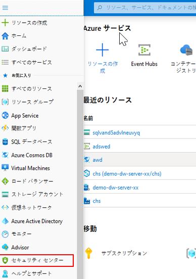
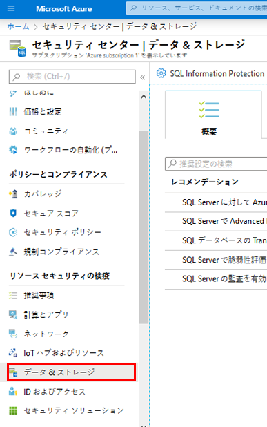

# DP 200 - データ プラットフォーム ソリューションの実装
# 課題 8 - Azure データ プラットフォームのセキュリティ保護

**予想時間**: 75 分

**前提条件**: この課題のケース スタディは既に確認していることを前提としています。本ラボは、モジュール 1 から 7 の内容と課題が完了したことを前提としています。

**ラボ ファイル**: この課題のファイルは、_Allfiles\Labfiles\Starter\DP-200.8_ フォルダーにあります。

## ラボの概要

受講者は、多層防御を提供するために取ることができるさまざまなセキュリティのアプローチを説明し、文書化することができるようになります。これには、本コースでこれまでに設定されたセキュリティの文書化が含まれます。また、AdventureWorks 内に存在する可能性のあるセキュリティのギャップの識別方法も学びます。

## 課題の目的
  
この課題を完了すると、次のことができるようになります。

1. セキュリティの説明
2. 主要なセキュリティ コンポーネントの説明
3. ストレージ アカウントと Data Lake Storage のセキュリティ保護
4. データ ストアのセキュリティ保護
5. ストリーミング データのセキュリティ保護

## シナリオ
  
あなたは、AdventureWorks のシニア データ エンジニアとして、顧客のデータ エステートが確実に保護されていることを確認する責任があります。必要な場所にセキュリティを確実に配置していることを確認するために、現在のインフラストラクチャのセキュリティ チェックを実行してます。この検査は、これまでに作成したすべてのサービスとデータの全体的な検査と、セキュリティの構成に存在する可能性のあるギャップの識別を目的としています。 

また、SQL Database DeptDatabasesxx のセキュリティの強化を求められ、さらに、データベースへのアクセスをモニターできるように、データベースに対する監査の構築を求められています。さらに、あなたはイベント ハブの管理アクセス許可の制限が十分でないことに気づき、このアクセス許可を削除する必要があると考えます。

このラボを完了すると:

1. セキュリティの説明
2. 主要なセキュリティ コンポーネントを説明しました
3. ストレージ アカウントと Data Lake Storage のセキュリティ保護
4. セキュリティで保護されたデータ ストア
5. ストリーミング データのセキュリティ保護

> **重要**: このラボを進めるにつれ、プロビジョニングまたは構成タスクで発生した問題を書き留め、_\Labfiles\DP-200-Issues-Docx_にあるドキュメントの表に記録してください。課題番号を文書化し、テクノロジを記述し、問題とその解決を説明します。このドキュメントは、後のモジュールで参照できるように保存します。

## 演習 1: セキュリティの概要

推定時間: 15 分

グループ エクササイズ
  
このエクササイズの主なタスクは、以下の通りです。

1. 階層化したアプローチとしてのセキュリティ。

2. インストラクターは、検出結果についてグループと話し合います。

### タスク 1: 階層化したアプローチとしてのセキュリティ。

1. 課題の仮想マシンから **Microsoft Word** を起動し、**Allfiles\Labfiles\Starter\DP-200.8** フォルダーからファイル **DP-200-Lab08-Ex01.docx** を開きます。

2. コースの内容、ケース スタディ、これまでコースで取り上げられたシナリオから、グループで **10 分間** かけて、課題で AdventureWorks を保護するためにこれまでに影響を与えたセキュリティ層を特定します。3 つの例をご覧ください。

### タスク 2: 検出結果についてインストラクターと話し合う

1. インストラクターは、検出結果について話し合うためにグループを中断させます。

> **結果**: このエクササイズを完了すると、Adventureworks でセキュリティを実装した方法と影響を受けたセキュリティ層の少なくとも 3 つの例を含む Microsoft Word ドキュメントが作成されます。

## 演習 2: 主なセキュリティ コンポーネント
  
推定時間: 10 分

個別エクササイズ
  
このエクササイズの主なタスクは次のとおりです。

1. データとストレージのセキュリティ衛生の評価

### タスク 1: データとストレージのセキュリティ衛生を評価する。

1. Azure portal タブで、 「**Security Center**」 をクリックします。

    

2. Security Center の Overview スクリーンで、**Recommendations** （レコメンデーション）をクリックします。

    

3. 注意が必要な上位 2 つの主要データおよびストレージ コンポーネントを特定します。

    1. __回答は異なる場合があります_____
    1. __回答は異なる場合があります_____

> **結果**: このエクササイズを完了すると、Azure サブスクリプション内のデータとストレージのセキュリティの弱点を特定する場所を学習することができます。

## 演習 3: ストレージ アカウントと Data Lake Storage のセキュリティ保護
  
推定時間: 15 分

個別エクササイズ
  
このエクササイズの主なタスクは次のとおりです。

1. Azure BLOB に対する適切なセキュリティ アプローチの決定

2. 検出結果についてインストラクターと話し合う

### タスク 1: Azure BLOB に対する適切なセキュリティ アプローチの決定

1. あなたは社内の Web 開発者から連絡を受け、サード パーティーの Web デザイン会社が awsastudxx ストレージ アカウントにある Web イメージへアクセスできるようにするのを支援してほしいと頼まれました。AdventureWorks のシニア データ エンジニアとして、正しいデューデリジェンスを適用しながらこれを確実に実現するには、どのような手順が必要となるでしょうか。

2. 課題の仮想マシンから **Microsoft Word** を起動し、**Allfiles\Labfiles\Starter\DP-200.8** フォルダーからファイル **DP-200-Lab08-Ex03.docx** を開きます。

### タスク 2: 検出結果についてインストラクターと話し合う

1. インストラクターは、検出結果について話し合うためにグループを中断させます。

> **結果**: このエクササイズを完了すると、サードパーティーの Web 開発会社に BLOB ストレージ アカウントへの安全なアクセスを提供するための手順を含む Microsoft Word ドキュメントが作成されます。

## 演習 4: データ ストアのセキュリティ保護
  
推定時間: 15 分

個別エクササイズ
  
このエクササイズの主なタスクは次のとおりです。

1. 監査の有効化

2. データベースをクエリする

3. 監査ログを表示する

### タスク 1: 監査の有効化

1. Azure portal で、**リソース グループ** をクリックしてから、「awrgstudxx」、「sqlservicexx」 の順にクリックして **AdventureworksLT (sqlservicekdwj/AdventureworksLT)** に移動します。

2. AdventureworksLT (sqlservicekdwj/AdventureworksLT) スクリーンで、「**監査**」 ブレードをクリックします。

3. **「監査」** で、**「オン」** ボタンをクリックします。

4. **ストレージ** ボックスをクリックしてから、**「ストレージ詳細 - 構成」** をクリックします。

5. **ストレージ設定**画面で、**サブスクリプション - ストレージ サブスクリプションの変更** をクリックし、サブスクリプションをクリックします。

6. **ストレージ設定** 画面で、「**ストレージ設定 - 必要な設定を構成**」 をクリックします。**ストレージ アカウントの選択** 画面で、**awsastudxx** をクリックします。

7. **保持日数** テキスト ボックスに**90** と入力し、**OK** をクリックします。

    

8. **「保存」**をクリックします。

### タスク 2: データベースをクエリする

1. Azure portal で、**リソース グループ** をクリックしてから、「awrgstudxx」、「sqlservicexx」 の順にクリックして **AdventureworksLT (sqlservicekdwj/AdventureworksLT)** に移動します。

2. **クエリ エディター** に移動する

3. 表示される **SQL サーバー認証** ウィンドウで、以下の詳細を入力してログインします。
    - ユーザー名: **xxsqladmin**
    - パスワード:  **P@ssw0r**

4. **「OK」** をクリックします 

> **注**: パスワードが正しくないため、エラー メッセージが返されます。正しいパスワード、**P@Ssw0rd** を入力します。

5. 正しいパスワード、**Pa55w.rd** を入力します。

6. **クエリ エディタ** で、**AdventureWorksLT** を展開してから、**Tables** を展開します。

7. 「SalesLT」.「Customers」 を右クリックし、**上位 1000 行の選択** をクリックします。

### タスク 2: 監査ログを表示する

1. Azure portal に戻ります。「AdventureWorksLT (sqlservicexx/AdventureWorksLT) - 監査」 画面で、「**監査ログの表示**」 をクリックします。

2. **監査レコード** ログ ファイルの **失敗した認証** レコードに注意してください。「**監査レコード**」 画面を閉じます

    

> **結果**: このエクササイズを完了すると、データベース監査を有効にし、監査が機能することを確認することができます。

## 演習 5: ストリーミング データのセキュリティ保護
  
推定時間: 15 分

個別エクササイズ
  
このエクササイズの主なタスクは次のとおりです。

1. イベント ハブのアクセス許可を変更する

### タスク 1: イベント ハブのアクセス許可を変更する

1. Azure portal 内のブレードで、**Resource groups** (リソース グループ) をクリックし、**awrgstudxx** をクリックし、**xx-phoneanalysis-ehn** をクリックします。**xx** がイニシャルとなります。

2. Azure portal の **xx-phoneanalysis-ehn** では、**xx** が自分のイニシャルとなります。ウィンドウの一番下までスクロールし、**xx-phoneanalysis-eh** イベント ハブをクリックします。

3. イベント ハブへのアクセスを許可するには、**Shared access policies** (共有アクセス ポリシー) をクリックする。

4. 「**socialtwitter-eh - Shared アクセス ポリシー**」 スクリーンで、「**socialtwitter-eh-sap**」 をクリックします。

5. アクセス許可を **管理** の横にあるチェックボックスをオンにして削除し、**保存** をクリックする。

6. Azure portalのブレードで、**ホーム** をクリックする。

> **結果**: この演習を完了した後、イベント ハブ共有アクセス ポリシーのセキュリティを変更した。